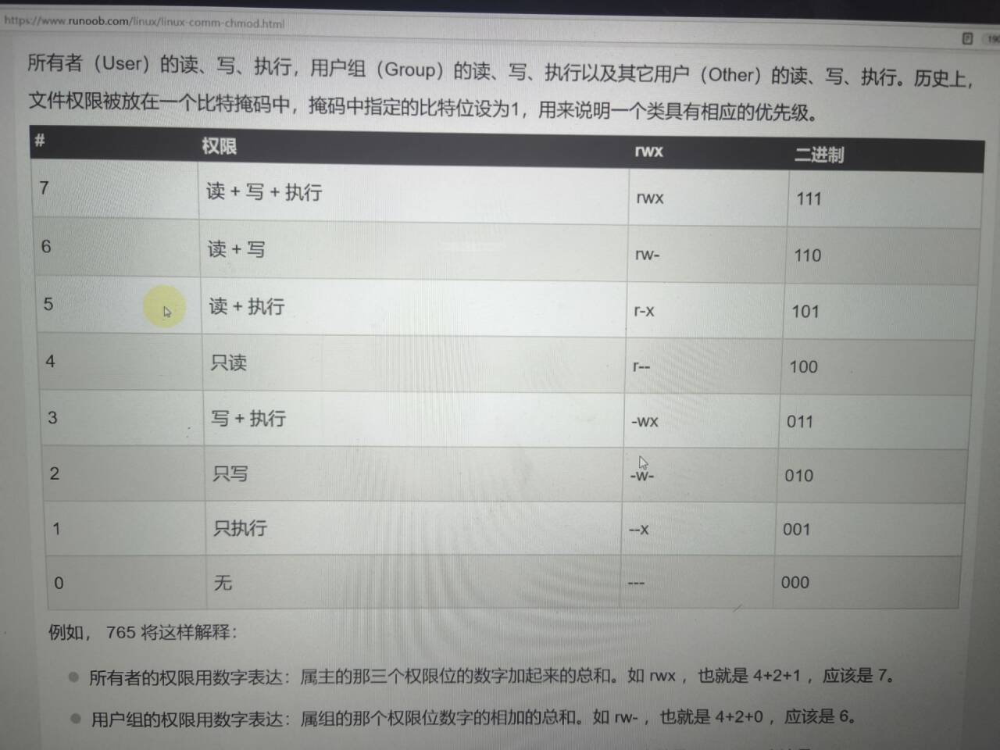

# Linuxの学习记录
***
##  指令：
  1. ls查看文件夹   
 2. ls-a查看隐藏的文件夹   
 3. man 显示指令的意思与含义  
 4. Ctrl c 强制停止程序运行  
 5. ctri shift+c才是复制  
 6. cd 去到某一路径  
 7. touch 创建某一文件  
 8. pwd 输出当前目录  
 9. Tab 自动补全  
 10. ctrl U 光标之前东西都删光  
 11. ctrl K 光标后东西都删光  
 12. mv 既可以重命名，也可以移动某文件，eg:mv 1.txt 重命名  
 13. rm最好不要用，因为删除后不能恢复  
 14. mkdir 创建文件夹  
 15. cat 查看  
 16. echo:输出  
 17. sleep 10 让电脑睡眠10秒钟  
 18. sleep 10& 把一个东西挂在后台  
 19. kill 干掉一个进程  
 20. PID：进程的代码  
21. jobs: 查看命令  
22. which:找到程序命令本体
23. find:查找文件     find-起始路径-name  
24. echo：在命令行输出指定的内容 其中用单引号包裹的内容将会被当成命令执行  
25. ">"将左侧命令的结果覆盖到右边指定文件中  
	">>"将左侧命令的结果追加到右边指定文件中  
	eg:echo"Hello World"〉1.txt  
26. tail查看文件尾部内容，语法tail [-f -num] 路径  
-f表示持续跟踪，-num表示你要查看尾部多少行不填默认10行  
27. grep命令：筛选有关键字的行  
grep [-n] 关键字  文件路径  
[-n]可不写  
27. wc命令 统计文件行数，单词数量等  
wc [-c -m -l -w] 文件路径  
-c 统计字节  
-m统计字符数量  
-l，统计行数  
-w统计单词数量  
28. 管道符：| 含义：将左边命令的结果作为右边命令的输入   相当于自动补全  
比如:cat 1.txt | grep "1"   
左边的1.txt自动补到右边的文件路径中  
***
### 重要命令  
~~~
安装软件
apt换元，安装，更新，升级，卸载  
安装：sudo apt install
更新：sudo apt update
升级：sudo apt upgrade 
卸载：sudo apt remove
~~~

~~~
环境变量 
环境变量：export zzp = "123"
输出：echo 用$输出的是123,用&输出的是地址  
全局变量，写到vim ~/.zshrc里面
zshrc（Z shell run commands）
~~~

~~~
进程
jobs命令用于显示当前进程
ps 查看进程
mount 挂载

~~~

~~~
软链接
ln命令的用法有两种形式：
创建硬链接：
ln [options] <target> <link_name>
target：要链接的目标文件或目录。
link_name：链接文件或目录的名称。
示例：
ln file1.txt link_to_file1.txt
这会在当前目录下创建一个名为link_to_file1.txt的硬链接，指向file1.txt文件。

硬链接是指多个文件名指向相同的物理数据块，它们共享相同的inode号，因此无论哪个文件名被使用，文件数据都是相同的。

创建符号链接（软链接）：
ln -s <target> <link_name>
target：要链接的目标文件或目录。
link_name：链接文件或目录的名称。
示例：

bash
Copy code
ln -s /path/to/directory link_to_directory
这会创建一个名为link_to_directory的符号链接，指向指定目录。

在其他目录创建软链接
ln -s /path/to/source_directory /home/user/another_directory/link_to_source_directory

这会在 /home/user/another_directory 中创建一个名为 link_to_source_directory 的软链接，指向 source_directory 目录。

符号链接（软链接）是一个特殊的文件，它包含对目标文件的路径引用。软链接类似于Windows系统中的快捷方式。
一些常用的选项：
-s：用于创建符号链接，如果不使用这个选项，则默认创建硬链接。
-f：如果目标文件已经存在，则强制执行创建链接，覆盖原有链接文件。
-v：显示详细信息，在创建链接时显示操作信息。

~~~

~~~
常用其他命令
grep 查找特定关键词
grep “pattern” 1.txt
sort 归类
sort 1.txt
alias 别名
alias ll = 'ls - l'

~~~
## 其他重要命令  
~~~
unzip file.zip
解压压缩包
复制别的目录里的文件到本目录
cp /path/to/other_directory/* .
~~~

## 笔记  
1. 挂载:插个U盘就叫挂载  
2. shell:外壳，用于人机交互 在命令之间用分号，可一次性执行多个命令  
	
	
***
## Git  
__Git是啥__：Git是一个免费，开源的分布式版本管理控制器  
	
	
可以清楚记录软件版本的变化，可以轻松退回以前的版本   
	
速度和性能很好  
	
	
__为什么要用Git__:git的用处就是当你的程序出错了，你能够退回到之前的版本， 储存以前的数据，防止你的失误导致整个系统无法使用  

***

## Vim编辑器  
有三种模式：  
1. 命令模式  
2. 输入模式   
3. 底线命令模式  
	
***
具体用法：
打开vim时进入命令模式  
可以通过快捷键i进入输入模式  
按ESC键退出回到命令模式  
保存文件或退出时用底线模式，按冒号  
在底线模式下按wq退出  
vim语法:vim 文件路径  
	
vim命令模式常用快捷键:  
~~~
i在当前光标位置进入输入模式  
a在当前光标位置之后进入输入模式  
I在当前行开头进入输入模式  
A在当前行的结尾进入输入模式  
o在光标下一行进入输入模式  
O在光标上一行进入输入模式  
0移动到行开头  
$移动到行结尾  
<mark>/进入搜索模式   
eg:   /const   搜索const这个词  
</mark>
n向下继续搜索  
N向上继续搜索  
替换  ：s/const/let/g 切换这一行所有的const为let  
全局替换  ：%s/const/let/g  
dd删除此行  
ndd n是数字，表示删除下面n行  
yy复制当前行  
nyy  
p粘贴复制的东西  
u撤销修改  
ctrl+r反撤销  
gg调到首行  
G跳到行尾  
dG从当前行开始，向下全部删除  
d$删除光标后面的内容（此行）  
d0。。。。前面。。。。。。。  
	
底线命令模式下的命令快捷键
wq保存并退出  
w仅保存  
q仅退出  
q!强制退出   
set nu显示行号 重要  
set paste设置粘贴模式  
~~~

### 基本命令   
~~~
cd 进入子目录 

cd .  进入本级目录 

cd .. 进入上一级 

cd  返回用户目录 

ll 查询目录所有文件 

ls -lt 按时间排列（从新到旧） 

ls -lr 按时间排序（ 从旧到新） 

ls -la 全部显示 

rm 删除文件 mv移动文件 

: w 保存 

: q退出 

: !强制 
~~~

正式使用vim  
首先进入终端  
	
此时我们可以输入ll 查询总目录  
	
如果想要进入某个文件 就输入 cd 加文件名  
	
如果想要返回上一级 就输入 cd .  
	
进入对应的文件后 输入 vim 加文件名  
	
然后就可以编写博客了  
	
进入文件时是命令模式  
	
此时输入 a 或者 i 就进入编辑模式了  
	
编辑完成后就输入ESC退出编辑模式  
	
此时就是命令模式 然后输入 :wq保存并退出  
	
此时我们要上传文件  
	
点击文件 进入带有auto-update-this-repo.sh的文件  
	
鼠标右击 然后就会出现 “open in terminal" 点击这个选项  
	
进入页面后输入 “bash a+TAB键”  
	
	
vim 常用命令  
~~~
移动光标 h 左移 j 下移 k 上移 l 右移  
删除字符  
x 删除光标处的一个字符  
dw 会删除整个单词（移动光标到单词头）  
d$ 会删除一整行（移动光标到句首）  
dgg 删除文本第一行  
dG 删除所有内容（必须是大写G）  
dd 删除一整行  
对对象使用计数  
w 向后移动到词首  
e 向后移动到词尾  
0 移动到行首  
计数+删除  
d2w 删除两个大写单词  
恢复命令（也就是撤销上一步操作）  
u 恢复最后命令 U恢复一整行  
ctrl+R 撤销恢复命令（与u命令相反）  
PUT 命令  
输入p在光标处粘贴先前删除的文本  
替换命令  
键入 rx 以替换光标处字符(键入r+要更正的字符）  
变更操作码  
ce (变更光标到词尾）键入ce 加正确的单词 \
翻页
下一页 ctrl + f
上一页 ctrl + b
~~~
***

## 环境变量 
起到预约的作用，使在没有这个文件的路径也能执行这个文件  
Linux中有全局变量和局部变量  
	
	
***
## root 用户
用su命令切换账户   
语法su-用户名  
 exit退出  
sudo 可以让普通命令带有root权限  
	
	
***
## 用户和用户组  
创建用户组命令  
groupadd 用户组名  
groupdel删除用户组  
groupdel删除用户组  
useradd 用户名 -g group1  
-g代表指定用户的组  
userdel  
	
getent  
查看系统中有哪些用户  
语法：getent  passwd   
	
chmod修改权限  
chown  
	 
## ip地址：  
每一台联网的电脑都会有一个地址，用于通讯  
ipv4的版本，还有ipv6的版本。  
ipv4的地址格式：a.b.c.d 如：192.168.88.101就是一个标准的IP地址  
可以通过ifconfig查看本机的ip地址  
	
## vim可视化模式  
按一下v，在通过hjkl选中，y  
yw复制一个单词  
y$从当前开始复制到行末尾  
p粘贴  
0补全角落  
o跑到前边  
也可以用跳跃命令  
vaw快速选择单词  
缩进:shift加尖括号< >  
shift和～大小写转换/  

## Linux101  
摩尔定律：集成电路上可容纳的晶体管数目每两年就会翻一倍  
Linux有很多分支..  
安卓就是Linux著名的一个分支  
	
***
### 1. 初识Linux  
配置与使用 SSH 连接远程的 Linux 服务器  
设置ssh密匙  
	
***
### 2. 个性化配置与建站体验  
设置外观，样式  
自动化脚本  
如何打开 shell:用Terminal  
图形界面:以在 Ubuntu Server 18.04.3 (未包含图形环境的系统) 上安装桌面环境为例。只需要执行以下步骤：  
	
安装 ubuntu-gnome-desktop 软件：  
$ sudo apt install ubuntu-gnome-desktop  
接下来的提示中按输入 Y 回车即安装。  
	
注意  
	
若安装非常缓慢，可以尝试更换国内的软件源。科大源更换教程  
	
安装完成后输入：  
$ sudo reboot  
重启 后可以看到，GNOME 桌面已经安装完成。我们拥有了图形界面。  
	
GNOME 的 Shell 扩展  
GNOME 支持很多扩展，并且有一个专门用于扩展的网站。 
  
	
要使用 GNOME 扩展，我们要先安装 gnome-shell-extensions。  
$ sudo apt install gnome-shell-extensions  
	
***
### 3.软件安装与文件操作  
在 Ubuntu 下，我们可以使用 Ubuntu Application Store 来进行安装，下图为应用商店中的 VSCode 应用页面。  
	
	
***
### 4.进程、前后台、服务与例行性任务
本章部分内容使用软件 htop 来讲解，建议在进一步阅读前使用 sudo apt install htop 安装并运行 htop，即时查看进程的各个属性。  
使用鼠标与键盘都可以操作 htop。Htop 界面的最下方是一些选项，使用鼠标点击或按键盘的 F1 至 F10 功能键可以选择这些功能，常用的功能例如搜索进程（F3, Search）、过滤进程（F4, Filter，使得界面中只有满足条件的进程）、切换树形结构/列表显示（F5, Tree/List）等等  
	
ps（process status）是常用的输出进程状态的工具。直接调用 ps 仅会显示本终端中运行的相关进程。如果需要显示所有进程，对应的命令为 ps aux。  
首先，有区分才有管理。进程标识符（PID，Process Identifier（是一个数字，是进程的唯一标识。在 htop 中，最左侧一列即为 PID。当用户想挂起、继续或终止进程时可以使用 PID 作为索引。  
	
在 htop 中，直接单击绿色条内的 PID 栏，可以将进程顺序按照 PID 升序排列，再次点击为降序排列，同理可应用于其他列。  
前后台切换  
上面的图片中，出现了 fg, bg 和 Ctrl + Z，涉及到的正是 shell 中前后台的概念。在 shell 中直接运行命令，将挂到前台，而如果不希望无力地看着屏幕输出不能做其他事情，那么便需要将程序切换到后台了。  
	
默认情况下，在 shell 中运行的命令都在前台运行，如果需要在后台运行程序，需要在最后加上 &：  
$ ./matmul &  # 例子：运行耗时的计算同时进行其他操作  
$ ps  
~~~
    PID TTY          TIME CMD
   1720 pts/0    00:00:00 bash
   1861 pts/0    00:00:06 matmul
   1862 pts/0    00:00:00 ps
~~~
$ # 使用 ps 命令，可以发现 matmul 程序在后台运行，同时我们仍然可以操作 shell  
而如果需要将前台程序切换到后台，则需要按下 Ctrl + Z 发送 SIGTSTP 使进程挂起，控制权还给 shell，此时屏幕输出如下所示，即（刚才挂起的进程）代号为 2，状态为 stopped，命令为 ping localhost  
我们可以使用 jobs 命令，看到当前 shell 上所有相关的进程了。这里，后台已经有一个进程在运行，所以 ping localhost 得到的代号是 2  
终止进程   
正如上所述，许多信号都会引发进程的终结，然而标准的终止进程信号是 SIGTERM，意味着一个进程的自然死亡。  
	
在 htop 中发送信号  
htop 中自带向进程发送信号的功能。按下 K 键，在左侧提示栏中选择需要的信号，按下回车发送。同时可以使用空格对进程进行标记，被标记的进程将改变显示颜色。此时重复上述过程，可对被标记进程批量发送信号。  
	
kill  
如前所述，Linux 上最常用的发送信号的程序就是 kill。  
	
$ kill -l # 显示所有信号名称  
 1) SIGHUP       2) SIGINT       3) SIGQUIT      4) SIGILL       5) SIGTRAP  
 6) SIGABRT      7) SIGBUS       8) SIGFPE       9) SIGKILL     10) SIGUSR1  
11) SIGSEGV     12) SIGUSR2     13) SIGPIPE     14) SIGALRM     15) SIGTERM  
16) SIGSTKFLT   17) SIGCHLD     18) SIGCONT     19) SIGSTOP     20) SIGTSTP  
21) SIGTTIN     22) SIGTTOU     23) SIGURG      24) SIGXCPU     25) SIGXFSZ  
26) SIGVTALRM   27) SIGPROF     28) SIGWINCH    29) SIGIO       30) SIGPWR  
31) SIGSYS      34) SIGRTMIN    35) SIGRTMIN+1  36) SIGRTMIN+2  37) SIGRTMIN+3  
38) SIGRTMIN+4  39) SIGRTMIN+5  40) SIGRTMIN+6  41) SIGRTMIN+7  42) SIGRTMIN+8  
43) SIGRTMIN+9  44) SIGRTMIN+10 45) SIGRTMIN+11 46) SIGRTMIN+12 47) SIGRTMIN+13  
48) SIGRTMIN+14 49) SIGRTMIN+15 50) SIGRTMAX-14 51) SIGRTMAX-13 52) SIGRTMAX-12  
53) SIGRTMAX-11 54) SIGRTMAX-10 55) SIGRTMAX-9  56) SIGRTMAX-8  57) SIGRTMAX-7  
58) SIGRTMAX-6  59) SIGRTMAX-5  60) SIGRTMAX-4  61) SIGRTMAX-3  62) SIGRTMAX-2  
63) SIGRTMAX-1  64) SIGRTMAX  
	如果不加任何参数，只有 PID，kill 命令将自动使用 15（SIGTERM）作为信号参数。  
	

立刻结束进程  
	
在信号中，9 代表 SIGKILL，收到这个信号之后，程序会立刻退出。  
	
在使用时，直接 kill -9 PID 即可。一个简单的记忆方法是：9 是最大的个位数。  
	
关于 kill 命令的来源  
其他类 kill 命令  
如果我们命令行中输入 apropos kill，我们可以发现各种其他的类 kill 命令，以及它们的简介。这里列举了一些：  
	
pgrep / pkill  
后面接模糊名称，实际上类似于对名称进行 grep 命令。pgrep 仅列出搜索到的进程名称符合用户输入的进程标识符，而 pkill 会根据用户的输入向进程发送信号。  
	
killall  
与 pkill 有一些类似，会向指定名字的进程发送信号。  
	
不要与 killall5 相混淆  
	
与 killall 不同，killall5 会向所有进程发送信号。这个命令名称来自 Unix System V 的系统管理命令（V 是罗马数字的 5）。  
	
xkill  
xkill 是针对窗口的 kill，运行该命令后，鼠标点击程序对应的窗口，就可以杀死该程序。  
	
脱离终端  
如果你使用过 SSH 连接到远程服务器执行任务，那么你会发现，你在 shell 中执行的程序在 SSH 断开之后会被关闭。这是因为终端一旦被关闭会向其中每个进程发送 SIGHUP（Signal hangup），而 SIGHUP 的默认动作即退出程序运行。  
孤儿进程 (orphan) 和僵尸进程 (zombie)  
父子关系引出了两种特殊的运行情况——父进程先退出，它的子进程成为孤儿进程 (orphan)；子进程先退出，而父进程未作出回应 (wait)，子进程则变为僵尸进程 (zombie)。  
	
孤儿进程（即留下的子进程）由操作系统回收，交给 init「领养」。  
	
僵尸进程的进程资源大部分已释放，但占用一个 PID，并保存返回值。系统中大量僵尸进程的存在将导致无法创建进程。  
***
### 5.用户与用户组、文件权限、文件系统层次结构  
略  
***
### 6.网络、文本处理工具与 Shell 脚本  
管道（pipe），操作符 |，作用为将符号左边的命令的 stdout 接到之后的命令的 stdin。管道不会处理 stderr。  
	
	
管道是类 UNIX 操作系统中非常强大的工具。通过管道，我们可以将实现各类小功能的程序拼接起来干大事。  
	
#### Shell 脚本  
什么是 Shell  
Shell 是 Linux 的命令解释程序，是用户和内核之间的接口。除了作为命令解释程序外，Shell 同时还提供了一个可支持强大脚本语言的程序环境。  
	
#### Bash  
Bourne Shell (sh)，是 Unix 系统的默认 Shell，简单轻便，脚本编程功能强，但交互性差。  
	
Bourne Again Shell，即 Bash，是 GNU 开发的一个 Shell，也是大部分 Linux 系统的默认 Shell，是 Bourne Shell 的扩展。  
	
Bash 允许用户定制环境以满足自己需要。通过修改环境文件   .bash_profile、.bashrc、.bash_logout，配置合适的环境变量，可以改变主目录、命令提示符、命令搜索路径等用户工作环境。  
	
此外，bash 也支持使用 alias 别名代替命令关键字（alias name='命令'）。输入 alias，可以查看目前存在的别名：  
	
#### alias  
alias alert='notify-send --urgency=low -i "$([ $? = 0 ] && echo terminal || echo error)" "$(history|tail -n1|sed -e '\''s/^\s*[0-9]\+\s*//;s/[;&|]\s*alert  
	
	
#### chmod  
##### UGO  
`u`代表的是`user`  
`G`代表了`group`  
`o`代表的是`other`  
有三种权限  
`r` 可读  
`w` 可写  
`x`可执行  
命令：chmod ugo+r 1.txt  
ugo 三个加一起就是a  
