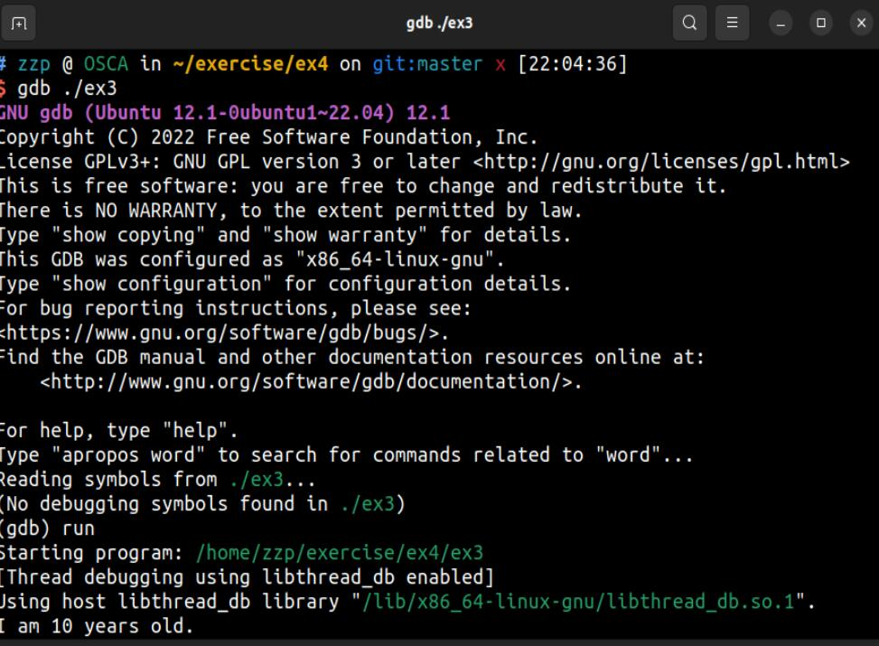
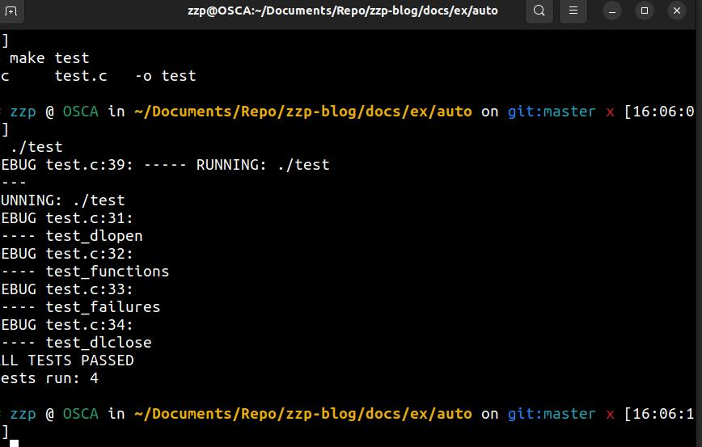

# C语言
!!! note "目的"
	
    这本书的目的是让我足够熟悉C语言，并能够使用它编写自己的软件，或者修改其他人的代  码。这本书中我会让你立即开始编程，之后我会解释你做了什么。这样更有效果，因为你已经经历过事情解释起来更加容易。      

​	
​		
​		

***
## ex2 makefile  
??? example 

    

??? abstract "附加题" 

    1.man make   
    
    
    
    2.man cc
    
    ~~~html
    cc -o hello hello.c   
    ~~~
    
    这个命令将hello.c编译成一个可执行文件，并将其命名为hello（使用-o选项指定输出文件名）。然后，你可以运行./hello来执行编译后的程序 -wall’这个命令后缀用于在编译过程中开启额外的警告信息，帮助程序员发现代码中潜在的问题或错误
    
    3.在另一个C语言项目中找到Makefile文件，并且尝试理解它做了什么。 

​	
​	
??? tip "Makefile工作原理"

    Makefile是一个包含一系列规则的文件，用于告诉make工具如何编译和构建软件项目。它描述了项目中源代码文件之间的依赖关系以及如何将它们编译成最终的可执行文件、库文件或其他目标文件。  
    
    当你运行make命令时，它会检查Makefile文件并执行其中定义的规则，这些规则指定了如何生成目标文件，以及哪些文件需要重新生成。  
    
    通常，Makefile包含以下内容：  
    
    目标(Targets)：指定要构建的最终输出文件的名称。例如，可执行文件的名称或库文件的名称等。  
    
    依赖关系(Dependencies)：指定了每个目标文件所依赖的源文件、头文件或其他目标文件。  
    
    规则(Rules)：规定了如何根据依赖关系生成目标文件的命令。这些规则由目标、依赖项和命令组成。  
    
    变量(Variables)：定义了在整个Makefile中使用的变量，这些变量可以包含编译器选项、文件路径等。  
    
    ### 一个实例
    
    ~~~html
    CC = gcc
    CFLAGS = -Wall -O2
    TARGET = my_program
    SRCS = main.c utils.c
    OBJS = $(SRCS:.c=.o)
    
    $(TARGET): $(OBJS)
        $(CC) $(CFLAGS) -o $@ $^
    
    %.o: %.c
        $(CC) $(CFLAGS) -c $< -o $@
    
    clean:
        rm -f $(OBJS) $(TARGET)
    ~~~
    
    在这个例子中：   
        
    CC 是C编译器的变量，CFLAGS 是编译器选项的变量。  
    	
    TARGET 是最终要生成的可执行文件的名称，SRCS 是源文件的列表，OBJS 是编译后的目标文件列表。  
    	
    第一个规则定义了如何生成最终的可执行文件。它告诉make如果$(OBJS)中的文件发生变化，应该使用$(CC)编译器和$(CFLAGS)选项将它们链接在一起形成$(TARGET)可执行文件。      
    	
    第二个规则告诉make如何将.c源文件编译成.o目标文件。  
    	
    clean规则是一个特殊的目标，用于删除生成的目标文件和可执行文件，以便重新构建整个项目。  
    通过make命令执行该Makefile，它将会根据规则编译源文件并生成最终的可执行文件。    Makefile使得构建复杂项目变得更加自动化和可靠。  

​    	
​	    
***
## ex3 格式化打印  
??? example 

      

***
## ex5 运算符，ex6语法    

??? abstract "附加题1"

    1.搜索“printf格式化”，试着使用一些高级的占位符。  
     %d: 用于输出十进制整数。  
    %f: 用于输出浮点数。  
    %c: 用于输出字符。  
    %s: 用于输出字符串。  
    %x 或 %X: 用于输出十六进制整数，分别表示小写字母和大写字母。  
    %o: 用于输出八进制整数。  
    %u: 用于输出无符号整数。  
    %e 或 %E: 用于以指数形式输出浮点数，分别表示小写字母和大写字母。  
    %p: 用于输出指针地址。  
    这些占位符通常用于格式化输出函数，比如 printf()、scanf() 等。   

??? abstract "附加题2"

    2.研究可以用几种方法打印数字。尝试以八进制或十六进制打印，或者其它你找到的方法。 
    ~~~
    #include <stdio.h>
    
    int main() {
        int number = 42;
    
        // 打印十进制数
        printf("Decimal: %d\n", number);
    
        // 打印八进制数
        printf("Octal: %o\n", number);
    
        // 打印十六进制数（小写字母）
        printf("Lowercase Hexadecimal: %x\n", number);
    
        // 打印十六进制数（大写字母）
        printf("Uppercase Hexadecimal: %X\n", number);
    
        return 0;
    }
    ~~~

??? abstract "附加题3"

    3.试着打印空字符串，即""。  
    /0  

??? abstract "附加题4"

    4..上网搜索unsigned做了什么。  
    unsigned long 是无符号长整型数据类型，只能表示非负整数。  

??? abstract "附加题5"

    5.试着自己解释（在下个练习之前）为什么char可以和int相乘。  
    在C语言中，char 类型和 int 类型都是整数类型，尽管它们的大小（占用的内存空间）可能不同。虽然 char 通常用来表示字符，但它本质上也是一个整数类型。  
    	
    C语言中的类型转换规则允许将较小的整数类型（如 char）在表达式中自动转换为更大的整数类型（如 int）进行运算。这种转换称为 隐式类型转换 （implicit type conversion）或 自动类型提升 （automatic type promotion）。  
    	    
    当 char 类型参与乘法运算时，它可能会被自动提升为 int 类型，然后进行乘法运算。这是因为在表达式中，C语言倾向于将较小的整数类型提升为较大的整数类型，以避免精度丢失或截断。  

***
## ex7 变量和类型  
??? example 

      
      
    
    有很多类型，整数型，浮点型，字符型  
    int对应%d  
    long 对应%ld  abcdefgabcdefg
    short对应%u  
    float 对应%f  
    double 对应%lf 
    char对应%c（单个字符）和%s（字符串）  
    字符串即多个字符  

​	
***
## ex8 if,else  
??? example

    

​	
​	
***
## ex9 while循环和布尔表达式  
??? example

    

***
## ex10 switch 循环  
??? example

    

​	
***
## ex11 数组  
??? abstract "数组"

    int arr[10]={1，2，3}  
    其中int 处填类型  
    arr处填数组名  
    int arr[10]表示的是生成__10__个位置  
    __但是__:数组中的每个元素都可以使用 arr[0] 到 arr[9] 的索引来访问，此时srr[9]才是指的第十个位置，因为在 C 中，数组索引从 0 开始。  

​    
??? abstract "附加题1"  

     1.尝试将areas的一个元素赋值为name中的字符。  
    会报错  

??? abstract "附加题2"  

    2.上网搜索在不同的CPU上整数所占的不同大小。  
    在不同的CPU架构或计算机体系结构中，整数所占用的大小可能会有所不同。C语言标准规定了整数类型的最小范围，但并未规定确切的大小，这使得不同的平台可以根据需求选择合适的整数表示方式。  
    	
    一些常见的整数类型及其在不同平台上的典型大小（以字节为单位）如下：  
    	
    char: 通常占 1 字节，至少能表示 -128 到 127 或者 0 到 255的范围，具体取决于是带符号还是无符号的 char。  
    short: 通常占 2 字节，在一些特殊的系统上可能占用更多或更少的空间。  
    int: 在大多数系统上通常占 4 字节，但也有一些系统上可能占用 2 或 8 字节。  
    long: 在32位系统上通常占 4 字节，在64位系统上通常占 8 字节。但这也取决于编译器和操作系统的具体实现。  
    long long: 通常占 8 字节，可以表示更大范围的整数值。  
    这些大小可能因为编译器、操作系统和硬件架构的不同而变化。例如，32位和64位系统上的整数大小可能不同，因为64位系统能够处理更大范围的内存地址和数据。  
    	
    为了获取特定平台上整数类型的确切大小，可以使用 sizeof 运算符。例如，sizeof(int) 可以告诉你在当前平台上 int 类型的字节数  

??? abstract "附加题3"

    3.如果一个字符数组占四个字节，一个整数也占4个字节，你可以像整数一样使用整个name吗？你如何用黑魔法实现它？  
    在理论上，可以将字符数组视为整数数组，并且通过某些技巧来操作它，使其表现得像一个整数数组。这涉及到对内存的低级别操作，需要考虑计算机的字节序（即大端序和小端序）等因素。  
    	    
    黑魔法或许可以利用联合体（union）的概念，这是C语言中一个特殊的数据结构，允许在同一内存空间存储不同的数据类型。这样可以在相同的内存位置上同时存储字符数组和整数，并可以通过一些操作在它们之间进行转换。  
    	
    以下是一个示例，展示了如何使用联合体将字符数组和整数绑定在一起：  
    ~~~
    #include <stdio.h>
    
    union 1 {
        char chars[4]; // 字符数组
        int number;    // 整数
    };
    
    int main() {
        union Magic data;
        
        // 赋值字符数组
        data.chars[0] = 'A';
        data.chars[1] = 'B';
        data.chars[2] = 'C';
        data.chars[3] = 'D';
    
        // 将字符数组转换为整数并输出
        printf("字符数组转换为整数: %d\n", data.number);
        
        // 修改整数值
        data.number = 123456789;
        
            // 将整数转换为字符数组并输出
        printf("整数转换为字符数组: %c %c %c %c\n", data.chars[0],             data.chars[1], data.chars[2], data.chars[3]);
        
        return 0;
    }
    ~~~
    union 1 { ... };：这定义了一个联合体（union）类型 1。联合体允许在相同的内存位置存储不同类型的数据。在这里，Magic联合体包含了两个成员：一个名为 chars 的长度为4的字符数组和一个名为 number 的整数。  
    	
    输出结果将是  
    ~~~
    字符数组转换为整数: 1145258561
    整数转换为字符数组: ݓ ƒ % @
    ~~~
    这些输出是根据具体的字符集和字符编码而变化的，因此输出的字符可能因系统和编译器而异。由于字符数组和整数共享相同的内存空间，在转换过程中，整数被当作字符来解释，而字符也被当作整数来解释。这种类型的转换在实际中可能导致不可预测的结果。  

??? abstract "附加题4"

    4..弄清楚在for循环的每一部分你都可以放置什么样的代码。  
    在C语言的 for 循环中，有三个部分，它们分别是初始化部分、循环条件部分和迭代部分。每个部分都有自己特定的语法，但几乎可以放置任何有效的语句或表达式。下面是每个部分可以放置的内容：  
    	
    初始化部分： 在循环开始之前只执行一次，通常用于初始化变量。  
    可以放置变量声明和赋值语句。例如：int i = 0; 或 float x = 1.5;  
    也可以放置函数调用，但这些函数必须返回一个值，如 someFunction();  
    循环条件部分： 在每次迭代开始前都会被检查，如果条件为真，则执行循环体内的代码，如果为  假，则退出循环。  
     可以放置条件表达式，比如 i < 10 或 x != 0。这些条件表达式必须返回一个布尔值     （真或假）。  
    也可以放置函数调用，但同样需要返回布尔值。例如：checkCondition();   
    
    迭代部分： 在每次循环结束后执行，通常用于更新循环控制变量。  
    可以放置增加或减少循环控制变量的语句，例如 i++、j -= 2。  

??? abstract "附加题5" 

    5.查询NULL是什么东西  
    NULL 是C语言中的一个常见标识符，用于表示空指针，可以帮助在程序中更加清晰地表达和处理空指针相关的情况。

  	
??? abstract "附加题6"

    6.argc argv 是什么  
    在程序执行时，操作系统会将命令行输入的参数传递给 main 函数。argc 表示参数的数量，而argv 是一个指针数组，每个指针指向一个以 null 结尾的字符串，这些字符串存储了实际传递给程序的命令行参数。argv[0] 存储的是程序的名称。

​    
??? abstract "附加题7"

    7.我已经向你简短地介绍了&&，它执行“与”操作。上网搜索与之不同的“布尔运算符”。  
    布尔运算符是用于执行逻辑运算的运算符。它们通常用于布尔类型的操作数（只有两个可能值：真和假），在计算机编程中经常使用。   
    
    在大多数编程语言中，布尔运算符包括以下几种：  
    	
    逻辑与（AND）：表示为 &&，当且仅当两个操作数都为真时，结果才为真。例如：A && B，当 A 和 B 同时为真时，结果为真，否则为假。  
    	
    逻辑或（OR）：表示为 ||，只要两个操作数中有一个为真，结果就为真。例如：A || B，当 A 或 B 其中一个为真时，结果为真，只有当两个都为假时，结果为假。  
    	
    逻辑非（NOT）：表示为 !，用于取反操作，将真变为假，将假变为真。例如：!A，当 A 为真时，结果为假；当 A 为假时，结果为真。  
    	
    这些布尔运算符在控制流语句、条件语句和循环结构等编程结构中扮演重要角色。它们使程序能够根据条件执行不同的代码路径，或根据给定的条件重复执行特定代码块。  

??? abstract "附加题8"

    8.使用if语句使循环提前退出。你需要break语句来实现它，搜索它的有关资料。  
        在(for、while、do-while)循环中，break 语句可以立即终止当前的循环，将控制转移到循环后的下一个语句。  
    在 switch 语句中，break 用于结束当前 case 分支的执行，使程序控制流跳出 switch 语句。  
    ### 命令  
    sizeof（name）  
    问c语言name这个量占多少字节  

​	
***
## ex12 For    
??? abstract "For循环"

    for(i = 1; i < argc; i++) {  
    printf("arg %d: %s\n", i, argv[i]);     
    }    
    其中i=1:初始化的变量/.  
    i < argc : 判断条件（不满足时会执行大括号里面的，满足则继续循环）  
    i++ : 自增恒量变量，就是循环的内容  
    其实不只是可以++，还可以+=2，就是自增2，可以在循环中用

​	
​	
​	
***
## ex12while语句
??? abstract "while循环"

    语法:  
    while(i＜arge)  
    {  
    printf"xxx";  
    i++;  
    }   
    其中（）中的__条件__，如果是true则执行大括号里面的，如果是false则跳出括号。  
    布尔表达式:只有true和false

​	
***
## ex13 Switch 语句  
??? abstract "Switch语句"

    语法：  
    switch(表达式){  
    case   
    case  
    default  

​	
***
## ex14 编写并使用函数  
??? abstract "编写函数"

    自己声明函数就跟脚本一样  
    比如以下  
    ~~~
    void print_arguments(int argc, char *argv[])
    {
        int i = 0;
    
        for(i = 0; i < argc; i++) {
            print_letters(argv[i]);
        }
    ~~~

​	
***
## ex15 指针  

???astract "指针"

    
    比如 int a =1 就是为a申请一个地方，名字为a，但是地址不会变。  
    int 类型储存的东西是整数  
    	
    了解内存空间之后，指针就好理解了  
    指针和 int一样，也是一种类型，不过它储存的是一个地址
    比如int\*p = &a  
    
    	
    指针名字叫p，int\*p指的是p是一个指针  &a是一个地址  
    int\*p = &a 代表的是把a的地址保存到p中  
    Int d = p 的话会直接报错，要int d =\*p  
    就把1这个数给了d   
    上面用到了两个\*，但此星非彼星  
    上面的\*是int\* ，是一种指针类型，同理有char\*,short\*,等  
    下面的星是间接运算符，是间接引用a的值。  

??? abstract "指针+-整数"

      
    数组是什么，默认是首元素的地址  指针取数组的地址实际是取的首元素的地址，也就是索引为0的地址  比如int\*p = arr  
    但是如果int\* p = &arr ，取出的是数组本身的地址  
    这张图片中的指针加整数的意思是让它往后索引几个  

### 指针数组和数组指针  
??? abstract "指针数组和数组指针"

    指针数组 - 数组 -存放指针的数组  
    数组指针 - 指针  
    字符串指针数组：char \*names[ ]  
    这种声明方式创建了一个数组，数组的每个元素都是一个指向字符串的指针。  
    相比于char  names[ ] 的优点：  
    char *names[] 的优势：  
    1. 动态长度的字符串存储：  
    	char \*names[] 声明的是一个字符串指针数组。这种声明方式允许存储不同  长度的字符串，因为每个元素都是一个指向字符（字符串）的指针。  
    	这种声明方法支持动态分配和存储不同长度的字符串。  
    	
    2. 方便指向其他字符串：  
    	使用字符串指针数组，可以方便地更改指针指向不同的字符串。例如，可以将指针重新赋值为其他字符串的地址。  
    	
    ***
    ## char names[] 的优势：  
    1. 静态字符串存储：  
    	char names[] 声明的是一个字符数组，通常用于存储静态长度的字符串。  
    	这种方式不太方便存储和处理不同长度的字符串。   
    	
    2. 更直接、更简单：   
    	对于单个字符串的存储和操作，使用 char names[] 可能更简洁直观，因为它直接存储字符串。  
    	
    ***
    ## 何时选择哪种方式？  
    如果需要存储和处理多个长度不同的字符串，或者需要在运行时动态地更改指向的字符串，那么 char *names[] 可能更适合。  
    如果只需要存储单个固定长度的字符串或者有明确的固定字符串长度限制，那么 char names[] 可能更为方便。  
    综合考虑不同场景下的需求，可以选择合适的字符串存储方式。  

​	
### ex15 题目与附加题
??? abstract "ex15"

    ~~~
    int ages[] = {23, 43, 12, 89, 2};
    char *names[] = {
        "Alan", "Frank",
        "Mary", "John", "Lisa"
    };
    ~~~
    这段代码定义了两个数组 ages 和 names。ages 是一个整数类型的数组，包含了一些年龄；  
    names 是一个__字符串指针数组__，包含了一些姓名。  
    ~~~
    int *cur_age = ages;
    char **cur_name = names;
    
    for(i = 0; i < count; i++) {
        printf("%s is %d years old.\n",
                *(cur_name+i), *(cur_age+i));
    }
    	
    ~~~
    其中char \*\*cur_name = names 这一段代码创建了指向names的指针。char \*已经是“指向char的指针”了，所以它只是个字符串。你需要两个层级，因为names是二维的，也就是说你需要char \*\*作为“指向‘指向字符的指针’的指针”。把它学会，并且自己解释它。  
    ~~~
    int *cur_age = ages;
    char **cur_name = names;
    	
    for(i = 0; i < count; i++) {
        printf("%s is %d years old.\n",
                *(cur_name+i), *(cur_age+i));
    }
    	
    ~~~
    这段代码再次展示了使用指针和数组下标来访问数组元素。这次直接使用指针变量 cur_name 和 cur_age 作为数组来访问元素。  
    为什么可以直接使用指针变量 cur_name 和 cur_age 作为数组来访问元素？  
    在 C 语言中，指针变量本质上是数组的首地址。当你声明指针 cur_name 和 cur_age 分别指向数组 names 和 ages 的起始位置时，这些指针变量包含了数组的地址。  
    因此，可以通过这些指针变量以及数组下标来访问数组中的元素。  
    __cur_name = names__实际上cur_name的值是names数组中的首个元素的值  
    
    ~~~
    for(cur_name = names, cur_age = ages;
            (cur_age - ages) < count;
            cur_name++, cur_age++)
    {
        printf("%s lived %d years so far.\n",
                *cur_name, *cur_age);
    }
    
    ~~~
    __让指针动起来__
    这段代码展示了一种复杂的方式，使用指针进行数组遍历。通过同时移动两个指针 cur_name 和 cur_age，通过对它们进行指针算术运算来访问数组元素，直到达到数组的末尾。  
    	
    ## 附加题  
    将for循环改为while循环，并且观察对于每种指针用法哪种循环更方便。  
    ~~~
    #include <stdio.h>
    
    int main() {
        int ages[] = {23, 43, 12, 89, 2};
        char *names[] = {
            "Alan", "Frank",
            "Mary", "John", "Lisa"
        };
    
        int count = sizeof(ages) / sizeof(int);
        int i = 0;
    
        // first way using indexing with while loop
        i = 0;
        while(i < count) {
            printf("%s has %d years alive.\n",
                    names[i], ages[i]);
            i++;
        }
    
        printf("---\n");
    
        // setup the pointers to the start of the arrays
        int *cur_age = ages;
        char **cur_name = names;
    
        // second way using pointers with while loop
        i = 0;
        while(i < count) {
            printf("%s is %d years old.\n",
                    *(cur_name + i), *(cur_age + i));
            i++;
        }
    
        printf("---\n");
    
        // third way, pointers are just arrays, with while loop
        i = 0;
        while(i < count) {
            printf("%s is %d years old again.\n",
                    cur_name[i], cur_age[i]);
            i++;
        }
    
        printf("---\n");
    
        // fourth way with pointers in a complex way, with while loop
        i = 0;
        while((cur_age - ages) < count) {
            printf("%s lived %d years so far.\n",
                    *cur_name, *cur_age);
            cur_name++;
            cur_age++;
            i++;
        } 
        return 0;
    }
    ~~~
    感觉while和for 对于指针遍历是差不多的  只不过while写的字多了点  

​	
​	

## ex16 结构体和指向它们的指针  
??? abstract "结构体和指针"

    在C语言中，结构体（Structures）是一种用户自定义的数据类型，允许你将__不同类型__的变量组合在一起，以表示一个相关联的__数据集合__。结构体可以包含各种不同类型的数据成员（也称为字段或属性），这些成员可以是整数、字符、指针、其他结构体等等。  
    
    结构体的定义使用关键字 struct，并指定结构体的名称以及包含在结构体内部的成员变量。  
    strcut和int一样，也是种类型  
    比如：  
    ~~~
    struct Person {
        char *name;
        int age;
        float height;
    };
    
    ~~~
    附加题
    ~~~
    struct Person *Person_create(char *name, int age, int height, int         weight)
    {
        struct Person *who = malloc(sizeof(struct Person));
        assert(who != NULL);
    
        who->name = strdup(name);
        who->age = age;
        who->height = height;
        who->weight = weight;
    
        return who;
    }
    
    ~~~
    这段代码是提前声明的自定义函数  
    其中struct是结构体的命令    
        malloc：用于分配内存以存储一个 Person 结构体大小的空间。  
    assert：用于断言 malloc 是否成功分配内存，若分配失败，则终止程序执行。  
    strdup：复制传入的姓名字符串并分配内存。  
    ~~~
     who->name = strdup(name);
        who->age = age;
        who->height = height;
        who->weight = weight;
    ~~~
    设置 Person 结构体实例的成员值  
    	
    return who  
    返回创建的实例指针。  
    \*who是实例指针  
    \*Person_create是函数指针  
    	
    ~~~ 
    void Person_destroy(struct Person *who)
    {
        assert(who != NULL);
    
        free(who->name);
        free(who);
    }
    
    ~~~
    Person_destroy 函数：用于释放通过 Person_create 创建的 Person 结构体实例的内存。  
    使用 free 函数释放姓名字符串的内存，然后释放整个结构体实例的内存。  

​    	
​    	
​    ~~~
​    void Person_print(struct Person *who)
​    {
​        printf("Name: %s\n", who->name);
​        printf("\tAge: %d\n", who->age);
​        printf("\tHeight: %d\n", who->height);
​        printf("\tWeight: %d\n", who->weight);
​    }
​    
​    ~~~
​    Person_print 函数：用于打印 Person 结构体实例的信息  
​    ~~~
​    int main(int argc, char *argv[])
​    {
​        // make two people structures
​        struct Person *joe = Person_create("Joe Alex", 32, 64, 140);
​    struct Person *frank = Person_create("Frank Blank", 20, 72, 180);
​    
​        // print them out and where they are in memory
​        printf("Joe is at memory location %p:\n", joe);
​        Person_print(joe);
​    
​        printf("Frank is at memory location %p:\n", frank);
​        Person_print(frank);
​    
​        // make everyone age 20 years and print them again
​        joe->age += 20;
​        joe->height -= 2;
​        joe->weight += 40;
​        Person_print(joe);
​    
​        frank->age += 20;
​        frank->weight += 20;
​        Person_print(frank);
​    
​        // destroy them both so we clean up
​        Person_destroy(joe);
​        Person_destroy(frank);
​    
        return 0;
    }
    
    ~~~
    main 函数：程序的入口点。  
    创建了两个 Person 结构体实例 joe 和 frank，并分别传入不同的参数。  
    修改了实例的属性值，然后再次打印了它们的信息。   
    最后，调用 Person_destroy 函数释放了 joe 和 frank 实例所占用的内存，完成了清理工作。  
    整个程序的主要功能是创建、操作和销毁 Person 结构体实例，并且通过函数对其进行了封装，以方便管理和使用。   

​    
​    	
​	
​	
​	
​	
***
## ex17 堆和栈的内存分配  
??? abstract "堆和栈的内存分配"

    在计算机科学中，堆（Heap）和栈（Stack）是两种常见的内存分配方式，用于存储程序运行时所需的数据。  
    	
    ## 栈 (Stack)
    ### 特点：  
    栈是一种线性数据结构，具有先进后出（FILO）的特性。  
    它的大小和生命周期是在编译时确定的，通常是__相对较小的固定大小__。  
    在函数调用时，会在栈上分配局部变量、函数参数、函数调用和返回地址等数据。  
    栈的分配和释放是__自动__的，由编译器/解释器管理。   
    	
    ### 用途：  
    存储函数的局部变量、函数参数和函数调用信息。  
    管理程序的执行上下文，如函数调用和返回。  
    	
    ## 堆 (Heap)  
    ### 特点：  
    堆是在程序运行时动态分配的内存区域，__大小不固定__。  
    在堆上分配内存需要__手动__申请和释放，否则可能导致内存泄漏或者内存溢出问题。  
    堆的分配和释放由程序员控制，使用像 __malloc()、free()（在C语言中）、new、    delete（在C++中）__等函数或运算符来完成。  
    	
    ### 用途：  
    存储动态分配的数据，如动态数组、对象等。  
    需要持久存储并且在不同函数间共享的数据。  
    	
    ## 区别  
    管理方式：栈的分配和释放是自动的，由编译器/解释器管理；而堆的分配和释放由程序员手动控制。  
    大小和生命周期：栈的大小和生命周期在编译时确定，通常较小；堆的大小不固定，并且可以在程序运行时动态分配和释放。  
    存储内容：栈用于存储函数调用、局部变量等；堆用于存储动态分配的数据，通常用于大量、持久或需要在不同函数间共享的数据。  
    在实际编程中，了解栈和堆的特点和用途对于正确、高效地管理内存是非常重要的。对于需要使用动态内存分配的情况，正确地申请、使用和释放堆内存是至关重要的，以避免内存泄漏和内存溢出等问题。  

??? abstract "作业与附加题"

    ~~~
    #include <stdio.h>
    #include <assert.h>
    #include <stdlib.h>
    #include <errno.h>
    #include <string.h>
    ~~~
    这些是预处理指令 (#include)，用于包含标准 C 语言库头文件，提供了输入输出、错误处理、内存分配和字符串处理等功能。  
    ~~~
    #define MAX_DATA 512
    #define MAX_ROWS 100
    
    ~~~
    这里使用 #define 定义了两个常量 MAX_DATA 和 MAX_ROWS，分别表示存储数据的最大长度和数据库中的最大行数。  

​    
​    ~~~
​    struct Address {
​        int id;
​        int set;
​        char name[MAX_DATA];
​        char email[MAX_DATA];
​    };
​    
​    struct Database {
​        struct Address rows[MAX_ROWS];
​    };
​    
​    struct Connection {
​        FILE *file;
​        struct Database *db;
​    };
​    
​    ~~~
​    接下来定义了三个结构体：Address、Database 和 Connection。  
​    Address 结构体表示数据库中的一条记录，包含一个 ID、一个标志位 set 以及姓名和邮箱等信息。  
​    Database 结构体是由多个 Address 结构体组成的数组，表示整个数据库。  
​    Connection 结构体包含一个文件指针和一个指向数据库的指针，用于连接数据库。  
​    ~~~ 
​    void die(const char *message)
​    {
​        if(errno) {
​            perror(message);
​        } else {
​            printf("ERROR: %s\n", message);
​        }
​    
​        exit(1);
​    }
​    
​    ~~~
​    然后定义了一系列函数用来操作数据库：  
​    die 函数用于报告错误并退出程序。  

​    	
​    ~~~
​    int main(int argc, char *argv[])
​    {
​        // ... (命令行参数解析和数据库操作)
​        return 0;
​    }
​    ~~~
​    最后，在 main 函数中：  
​    解析命令行参数来确定要执行的操作，比如创建、获取、设置、删除或列出条目。  
​    根据操作执行相应的数据库操作，并在必要时输出错误信息。  
​    最后关闭数据库连接并退出程序。  
​    整个程序实现了一个简单的命令行数据库管理系统，可以通过命令行对数据进行增删改查等操作。  

​    	
​    
​    ***
​    ## 附加题  
​    搜索“栈数据结构”，并且在你最喜欢的语言中实现它，然后尝试在C中实现。  
​    ~~~
​    #include <stdio.h>
​    #include <stdlib.h>
​    
​    #define MAX_SIZE 100
​    
​    // 定义栈结构
​    typedef struct {
​        int items[MAX_SIZE];
​        int top; // 栈顶指针
​    } Stack;
​    
​    // 初始化栈
​    void initStack(Stack *stack) {
​        stack->top = -1; // 初始化栈顶指针为-1
​    }
​    
​    // 检查栈是否为空
​    int isEmpty(Stack *stack) {
​        return (stack->top == -1);
​    }
​    
​    // 检查栈是否已满
​    int isFull(Stack *stack) {
​        return (stack->top == MAX_SIZE - 1);
​    }
​    
​    // 压栈操作
​    void push(Stack *stack, int value) {
​        if (isFull(stack)) {
​            printf("栈已满，无法压栈\n");
​        } else {
​            stack->top++;
​            stack->items[stack->top] = value;
​        }
​    }
​    
    // 出栈操作
    int pop(Stack *stack) {
        if (isEmpty(stack)) {
            printf("栈为空，无法出栈\n");
            return -1; // 如果栈为空，返回一个特殊值表示出错
        } else {
            int popped = stack->items[stack->top];
            stack->top--;
            return popped;
        }
    }
    
    // 查看栈顶元素
    int peek(Stack *stack) {
        if (isEmpty(stack)) {
            printf("栈为空\n");
            return -1; // 如果栈为空，返回一个特殊值表示出错
        } else {
            return stack->items[stack->top];
        }
    }
    
    int main() {
        Stack stack;
        initStack(&stack);
    
        push(&stack, 10);
        push(&stack, 20);
        push(&stack, 30);
    
        printf("栈顶元素为: %d\n", peek(&stack)); // 输出栈顶元素
    
        printf("出栈: %d\n", pop(&stack)); // 出栈
    
        printf("栈顶元素为: %d\n", peek(&stack)); // 输出栈顶元素
    
        return 0;
    }
    ~~~

​	
***
## ex18函数指针 
??? abstract "函数指针" 

    函数指针的格式类似这样：  
    ~~~
    int (指针名)(int a, int b)  
    ~~~
    记住如何编写它的一个方法是：  
    	
    编写一个普通的函数声明：  
    ~~~
    int callme(int a, int b)  
    ~~~
    将函数用指针语法包装：  
    ~~~ 
    int (*callme)(int a, int b)  
    ~~~
    将名称改成指针名称：   
    ~~~
    int (*compare_cb)(int a, int b)  
    ~~~
    指针的变量名称为compare_cb，你可以将它用作函数。这类似于指向数组的指针可以表示所指向的数组。指向函数的指针也可以用作表示所指向的函数，只不过是不同的名字。  
      
    这就是一个函数指针，它储存了show这个函数  
    为了和普通指针区别一下，它用了括号括住了  
    调用函数可以直接用show()或者 pFun()  
    ### 回调函数  
    有两个函数A,B，函数A有参数，参数是函数B，则B就是回调函数  
    被当做参数来使用的函数就是回调函数  
??? abstract "回调函数"

    ~~~
    #include <stdio.h>
    
    // 声明回调函数的原型，该函数接受一个整数作为参数
    typedef void (*CallbackFunc)(int);
    
    // 主函数，接受回调函数作为参数
    void performOperation(int data, CallbackFunc callback) {
        // 执行某些操作，然后调用回调函数并将数据传递给它
        printf("Performing operation with data: %d\n", data);
        callback(data); // 调用回调函数
    }
    
    // 回调函数的具体实现
    void callbackFunction(int result) {
        printf("Callback function called with result: %d\n", result);
    }
    
    int main() {
        int inputData = 10;
    
        // 调用 performOperation，并传递回调函数作为参数
        performOperation(inputData, callbackFunction);
    
    return 0;
    }
    
    ~~~
    这段代码表示的是回调函数的基本用法  
    其中出现了3个函数，让我们来一起看一看  
    ~~~
    typedef void (*CallbackFunc)(int);
    ~~~
    这个函数是一个声明函数，声明回调函数的原型，该函数接受一个整数作为参数  
    ~~~
    void performOperation(int data, CallbackFunc callback) {
        printf("Performing operation with data: %d\n", data);
        callback(data); 
    ~~~
    这个函数是一个中间函数，把用户传进来的数据进行一些操作，函数体内部可能包含了一些未给出的具体操作，这些操作会在执行时使用传递进来的 data 数据。  
    这个函数的作用是：
    1. 接收参数： 函数 performOperation 接收两个参数：data（整数类型）和 callback（函数指针，指向一个回调函数）。  
    2. 执行某些操作： 函数体内部可能包含了一些未给出的具体操作，这些操作会在执行时使用传递进来的 data 数据。  
    3. 调用回调函数： 在执行完上述操作之后，通过 callback(data); 这行代码调用了传递进来的回调函数，并将参数 data 传递给它。这就是回调函数的作用之一，它允许你在 performOperation 内部执行完特定的任务后，通过调用传入给回调函数，将数据或结果返回或通知给调用者。  
    	
    ~~~
    void callbackFunction(int result) {
        printf("Callback function called with result: %d\n", result);
    ~~~
    这个函数就是回调函数  
    performOperation把数据整理并调用给了它  

​	
## ex19 一个简单的对象系统  
??? abstract "一个简单的对象系统" 

    # 预处理  
    预处理不是真正编译的一部分 它是编译代码前一个单独的步骤  
    ## 宏  
    宏（Macro）在 C 语言中是一种非常有用的_工具_，它允许你用一个_标识符_来代表一个值或者一段代码，然后在程序中通过这个标识符来_引用_这个值或代码。  
    ### 用途  
    1. 创建常量：可以使用宏来定义常量，例如：
    ~~~
    #define PI 3.14159
    
    ~~~
    
    这样就定义了一个名为_ PI _的宏，它代表的值是 3.14159。这样在程序中就可以使用 PI 这个_标识符_来表示 π 的值了  
        	
    2. 简化代码：宏也可以用于简化代码。比如，你可以创建一个计算平方的宏：  
    ~~~
    #define SQUARE(x) ((x) * (x))
    
    ~~~
    然后在程序中使用 SQUARE 这个宏，传入一个参数 x：  
    ~~~
    int result = SQUARE(5); // 会被展开为 ((5) * (5))
    
    ~~~
    这样就避免了每次都写 x * x，提高了代码的可读性和易用性。  
    	
    3. 条件编译：宏还可以用于条件编译，例如：  
    ~~~
    #define DEBUG 1
    
    #ifdef DEBUG
            // 调试代码
        // 这部分代码只有在 DEBUG 被定义的情况下才会被编译
    #endif
    
    ~~~
    这种方式可以让你根据宏的定义与否来控制代码的编译。  
    	
    虽然宏在某些情况下非常有用，但也要注意宏的一些_潜在问题_，比如宏展开可能导致代码难以调试、宏的作用域难以控制等。因此，在使用宏时需要谨慎并遵循最佳实践，以避免潜在的问题。  
    ## 宏的本质  
    预处理器只不过是做了一个文本替换的工作而已  
    所有预处理命令都是以#开头   
    ### 常见的预指令处理   
      
    1. #include  
    #include 指令用于将*其他文件的内容包含到当前文件中*。这是用于引入头文件的常见方式，使得程序可以重复利用其他文件中的函数声明、宏定义等信息。
    2. #define
    #define *用于创建宏定义*，将一个标识符或表达式定义为一个特定的代码片段。这种方式可以用于创建常量、简化代码或定义一段代码片段。
    3. #ifdef, #ifndef, #else, #endif
    条件编译指令用于根据条件来控制代码的编译。比如，#ifdef 用于检查某个宏*是否已经被定义*，#ifndef 用于检查某个宏*是否未被定义*，#else 和 #endif 则用于*定义条件的分支和结束。*
    4. #undef
    #undef 用于取消宏的定义，使得该宏可以重新定义或者在之后的代码中不再生效。
    5. #error
    #error 用于生成编译时错误信息，当预处理器遇到这个指令时，会停止编译并显示指定的错误消息。
    6. #pragma## 预处理  
    预处理不是真正编译的一部分 它是编译代码前一个单独的步骤  
    ## 宏  
    宏（Macro）在 C 语言中是一种非常有用的_工具_，它允许你用一个_标识符_来代表一个值或者一段代码，然后在程序中通过这个标识符来_引用_这个值或代码。  
    ### 用途  
    1. 创建常量：可以使用宏来定义常量，例如：
    ~~~
    #define PI 3.14159
    
    ~~~
    
    这样就定义了一个名为_ PI _的宏，它代表的值是 3.14159。这样在程序中就可以使用 PI 这个_标识符_来表示 π 的值了  
    	
    2. 简化代码：宏也可以用于简化代码。比如，你可以创建一个计算平方的宏：  
    ~~~
    #define SQUARE(x) ((x) * (x))
    
    ~~~
    然后在程序中使用 SQUARE 这个宏，传入一个参数 x：  
    ~~~
    int result = SQUARE(5); // 会被展开为 ((5) * (5))
    
    ~~~
    这样就避免了每次都写 x * x，提高了代码的可读性和易用性。  
    	
    3. 条件编译：宏还可以用于条件编译，例如：  
    ~~~
    #define DEBUG 1
    
    #ifdef DEBUG
        // 调试代码
        // 这部分代码只有在 DEBUG 被定义的情况下才会被编译
    #endif
    
    ~~~
    这种方式可以让你根据宏的定义与否来控制代码的编译。  
    	
    虽然宏在某些情况下非常有用，但也要注意宏的一些_潜在问题_，比如宏展开可能导致代码难以调试、宏的作用域难以控制等。因此，在使用宏时需要谨慎并遵循最佳实践，以避免潜在的问题。  
    ## 宏的本质  
    预处理器只不过是做了一个文本替换的工作而已  
    所有预处理命令都是以#开头   
    ### 常见的预指令处理   
      
    1. #include  
        #include 指令用于将*其他文件的内容包含到当前文件中*。这是用于引入头文件的常见方式，使得程序可以重复利用其他文件中的函数声明、宏定义等信息。
    2. #define
    #define *用于创建宏定义*，将一个标识符或表达式定义为一个特定的代码片段。这种方式可以用于创建常量、简化代码或定义一段代码片段。
    3. #ifdef, #ifndef, #else, #endif
    条件编译指令用于根据条件来控制代码的编译。比如，#ifdef 用于检查某个宏*是否已经被定义*，#ifndef 用于检查某个宏*是否未被定义*，#else 和 #endif 则用于*定义条件的分支和结束。*
    4. #undef
    #undef 用于取消宏的定义，使得该宏可以重新定义或者在之后的代码中不再生效。
    5. #error
    #error 用于生成编译时错误信息，当预处理器遇到这个指令时，会停止编译并显示指定的错误消息。
    6. #pragma
    #pragma 用于向编译器传递特定的指令。这些指令通常用于控制编译器的行为，如优化选项、警告信息等。
    7. 文件包含保护指令
    	用于防止头文件被多次包含而导致的重定义错误。常见的方式是使用 #ifndef,         #define, #endif 来创建头文件的包含保护结构。
    
    宏中的小问题，加括号  
    
    #pragma 用于向编译器传递特定的指令。这些指令通常用于控制编译器的行为，如优化选项、警告信息等。
    7. 文件包含保护指令
    	用于防止头文件被多次包含而导致的重定义错误。常见的方式是使用 #ifndef, #define, #endif 来创建头文件的包含保护结构。

### C中构建面向对象系统  
??? abstract "C中构建面向对象系统" 
    
    ## 对象是什么  
    对象就是你的女朋友，你自己也是一个对象  
    对象就是实物，一种实物的一个个体  
    比如我是人类的一个个体  

​    	
​    	
​    	
​    ***
​    ## 定义  
​    面向对象系统（Object-Oriented System）是一种程序设计范式，它使用对象和类的概念来组织和构建程序。这种方法的核心思想是_将数据和操作封装在一起，通过对象来表示现实世界中的实体，并允许这些对象相互交互。_  
​    	
​    面向对象的四大特征  
​    1.抽象  
​    抽象行为，抽象属性  
​    属性： 一类事物的共同特征，比如人类的年龄，性别，编号  
​    行为：吃饭，睡觉，跑步  
​    2.封装  
​    把抽象出来的属性和行为封装成一个类(结构体)  
​    3.继承  
​    把父类的属性和行为继承给子类，子类就拥有了父类的属性和行为  
​    4.多态  
​    	
​    主要概念：  
​    类（Class）：类是对象的模板或蓝图，描述了对象的属性（数据成员）和行为（成员函数）。比如，汽车类可能有属性如速度、颜色等，并且可能有方法如启动、加速等。  
​    	
​    对象（Object）：对象是类的实例，具有特定的属性和行为。例如，一辆特定的汽车可以看作是汽车类的一个对象实例。  
​    	
​    封装（Encapsulation）：封装是指将数据和操作封装在一个对象内部，_并对外部隐藏其内部实现细节。_只有通过对象提供的接口（公共方法）才能访问对象的状态。  
​    	
​    继承（Inheritance）：继承允许一个类（子类）继承另一个类（父类）的属性和行为。子类可以重用父类的功能，并且可以增加新的功能或修改已有功能。  
​    	
​    多态（Polymorphism）：多态性允许不同类的对象对同一消息做出不同的响应。即使这些对象所接收的消息相同，但由于不同类实现了相同的方法，它们可能会有不同的行为。  
​    	
    为什么重要？  
    面向对象编程的优点在于它可以提高代码的可维护性、可扩展性和重用性。  
    通过封装数据和功能，对象可以隐藏其内部细节，使得代码更易于理解和修改。  
    继承和多态性使得代码更容易扩展和重用，减少了重复编写代码的工作量。  
    	
    在 C 语言中，并没有原生的面向对象特性，但可以使用一些技巧模拟面向对象的部分特性，如结构体和函数指针来模拟类和方法。  
    然而，如果你对面向对象的概念感兴趣，建议学习一些支持面向对象编程的语言，如 C++、Java 或 Python，它们提供了更直接和丰富的面向对象特性。  
    	
    ## c语言中实现面向对象的系统  
    在 C 语言中实现面向对象（Object-Oriented Programming, OOP）的系统需要使用一些技巧和约定，因为 C 本身并不直接支持_类、对象、继承等面向对象的概念。_然而，可以使用一些模拟方法来实现类似面向对象的设计。  
    	
    例子：
    属性：年龄，姓名  
    行为：说话  
    其他：输出自己的信息  
    ~~~
    include<stdio.h>
    include<malloc.h>
    include<string.h>
    include<
    typedef0 struct Girl{
    int age //年龄
    char name[20];
    
    }Girl;
    //注意：struct 里面不允许定义函数,所以拿到外面来
    Girl* createGirl();
    Girl* createGirlwithargs(int age,char name);
    void girl_print(Girl * pthis)
    {
    printf("%d %s",pthis ->age,pthis ->name);
    }
    
    int main()
    {
    Girl* emptyGirl = createGirl();
    Girl* yueyue = createGirlwithargs(int age,char name)(25;“月月”);
    }
    
    Girl* createGirl()
    {
    Girl* girl = calloc(1,sizeof(girl));
    if(！Girl）
    {
    return NULL;
    }
    return girl；
    }
    
    Girl* createGirlwithargs(int age,char name)
    {
    Girl *girl = createGirl();
    if(！Girl）
    {
    return NULL;
    }
    girl -> age =age
    girl -> name = name
    return girl；
    ~~~
    
    ### 注  
    typedef 是 C 语言中的一个关键字，用于创建新的类型别名。它允许程序员为现有的数据类型（如基本数据类型、结构体、指针等）定义一个新的、更具有描述性的名称。  
    	
    通过 typedef，可以为一个已存在的类型创建一个新的别名。这个别名可以让代码更易读、更易维护，并且提高了代码的可读性。它经常用于简化复杂的类型声明，特别是当你使用复杂的数据类型时。  
    	
    例如，在之前的代码中，我们使用了 typedef 来定义一个结构体类型别名 Object：  
    把标签放最后面使它成为一个新的类型  
    	
    其中pthis 是一个指针，指向Girl这个结构体  
    在 C 语言中，箭头操作符 -> 用于通过指向结构体或联合体的指针访问其成员。它的作用类似于使用点操作符 . 来访问结构体或联合体的成员，但是针对指针而不是实际的结构体或联合体本身。  
    最下面的操作里calloc和malloc一样都是分配空间的操作    

​    	
​	
​	
## ex20 调试宏  
??? abstract "测试宏"

    ## 调试  
    调试（Debugging）是指识别、定位和解决计算机程序或系统中出现的错误、故障或异常的过程。在软件开发中，程序员编写代码并进行测试，但有时代码可能会产生意外的行为，导致程序不按预期运行或出现错误。  
    	
    调试的目的是找出程序中的错误并加以修复，使程序能够按照预期的方式正常运行。这个过程通常涉及以下步骤：  
    	
    重现问题： 程序员首先要能够重现导致程序错误或异常行为的情况。这可能需要重新运行程序或者使用特定的输入数据。  
    	
    定位问题： 一旦问题被重现，程序员会使用调试工具或技术来定位问题所在。这可能涉及查看程序的代码、检查变量的值、跟踪代码执行路径等。  
    	
     识别错误： 确定问题的具体原因，这可能是由于逻辑错误、语法错误、内存问题、数据处理错误等。  	   
    	
    修复错误： 一旦问题被定位并识别，程序员会修改代码以解决问题，并进行进一步测试，以确保修改不会引入新的错误。  
    	
    验证和测试： 修改后的程序需要经过验证和测试，以确保问题已经解决，程序运行正常。  
    	
    调试是程序开发过程中不可或缺的一部分，因为即使经验丰富的开发人员也难以编写完全没有错误的程序。使用调试工具和技术可以帮助程序员更快速地定位和解决问题，提高代码质量和稳定性。调试也有助于开发人员更深入地理解程序的运行方式和行为。  
    ## 如何调试  
    1.编译   
    make ex10  
    2.调试  
    lldb ex10  
    3.打断点  
    break set--name:main
    就会在main处打一个断点  
    	
    ## 设计出来用于调试的宏  
    C通过返回错误码或设置全局的errno值来解决这些问题，并且你需要检查这些值。这种机制可以检查现存的复杂代码中，你执行的东西是否发生错误。当你编写更多的C代码时，你应该按照下列模式：  
    	
    调用函数。  
    如果返回值出现错误（每次都必须检查）。  
    清理创建的所有资源。  
    打印出所有可能有帮助的错误信息。  
    这意味着对于每一个函数调用（是的，每个函数）你都可能需要多编写3~4行代码来确保它正常功能。这些还不包括清理你到目前创建的所有垃圾。如果你有10个不同的结构体，3个方式。和一个数据库链接，当你发现错误时你应该写额外的14行。  
    ***
    ~~~
    #ifndef __dbg_h__
    #define __dbg_h__
    
    #include <stdio.h>
    #include <errno.h>
    #include <string.h>
    
    #ifdef NDEBUG
    #define debug(M, ...)
    #else
    #define debug(M, ...) fprintf(stderr, "DEBUG %s:%d: " M "\n", __FILE__, __LINE__, ##__VA_ARGS__)
    #endif
    
    #define clean_errno() (errno == 0 ? "None" : strerror(errno))
    
    #define log_err(M, ...) fprintf(stderr, "[ERROR] (%s:%d: errno: %s) " M "\n", __FILE__, __LINE__, clean_errno(), ##__VA_ARGS__)
    
    #define log_warn(M, ...) fprintf(stderr, "[WARN] (%s:%d: errno: %s) " M "\n", __FILE__, __LINE__, clean_errno(), ##__VA_ARGS__)
    
    #define log_info(M, ...) fprintf(stderr, "[INFO] (%s:%d) " M "\n", __FILE__, __LINE__, ##__VA_ARGS__)
    
    #define check(A, M, ...) if(!(A)) { log_err(M, ##__VA_ARGS__); errno=0; goto error; }
    
    #define sentinel(M, ...)  { log_err(M, ##__VA_ARGS__); errno=0; goto error; }
    
    #define check_mem(A) check((A), "Out of memory.")
    
    #define check_debug(A, M, ...) if(!(A)) { debug(M, ##__VA_ARGS__); errno=0; goto error; }
    
    #endif
    ~~~
    大佬写出来的宏，用于处理错误问题  
    用的时候直接include dbg.h就行了  
    这段代码是一个简单的调试宏和错误处理宏集合，它定义了一些宏来辅助程序员进行调试和错误处理。让我逐行解释这些代码：  
    ~~~
    #ifndef __dbg_h__
    #define __dbg_h__
    ~~~
    #ifndef 检查是否定义了名为 __dbg_h__ 的宏。  
    #define 定义了 __dbg_h__ 宏，以防止多次包含同一个头文件。  
    	
    #ifdef 检查是否定义了 NDEBUG 宏，如果定义了，则定义 debug(M, ...) 为空宏。  
    如果未定义 NDEBUG，则定义 debug(M, ...) 宏为一个输出调试信息的函数。它使用 fprintf 函数将调试信息输出到标准错误流中（stderr），包括文件名、行号和格式化的消息内容。  
    	
    #define clean_errno() (errno == 0 ? "None" : strerror(errno))  
    定义了一个 clean_errno() 宏，用于返回当前错误号的字符串描述。如果错误号为0（即没有错误），则返回字符串 "None"；否则，返回通过 strerror(errno) 得到的描述错误的字符串。  
    接下来的一系列宏 log_err, log_warn, log_info, check, sentinel, check_mem, check_debug 使用了类似的模式，它们都是用来打印错误信息、检查条件、处理错误的宏。这些宏会在发生错误或者满足条件时，输出相应的信息，并跳转到错误处理代码段（通常是 goto error;）。  
    	
    这是一个使用调试宏的例子：  
    ~~~
    #include "dbg.h"  // 引入包含调试宏的头文件
    
    int main() {
        int x = 10;
        debug("x is: %d", x);  // 在程序中使用 debug 宏输出调试信息
    
        // ... 其他代码 ...
    
        return 0;
    }
    ~~~
    上面的代码中，#include "dbg.h" 将包含了定义了调试宏的头文件，使得 debug() 宏在代码中可用。在 main() 函数中，调用 debug() 宏并传入了一个格式化的调试信息字符串和相应的参数。在这个例子中，debug() 宏会在调试模式下输出带有文件名、行号和调试信息的内容。  
??? abstract "具体内容" 

    ~~~
    #ifndef __dbg_h__
    #define __dbg_h__
    
    #include <stdio.h>
    #include <errno.h>
    #include <string.h>
    
    #ifdef NDEBUG
    #define debug(M, ...)
    #else
    #define debug(M, ...) fprintf(stderr, "DEBUG %s:%d: " M "\n",     __FILE__, __LINE__, ##__VA_ARGS__)
    #endif
    
    #define clean_errno() (errno == 0 ? "None" : strerror(errno))
    
    #define log_err(M, ...) fprintf(stderr, "[ERROR] (%s:%d: errno: %s) " M "\n", __FILE__, __LINE__, clean_errno(), ##__VA_ARGS__)
    
    #define log_warn(M, ...) fprintf(stderr, "[WARN] (%s:%d: errno: %s) " M "\n", __FILE__, __LINE__, clean_errno(), ##__VA_ARGS__)
    
    #define log_info(M, ...) fprintf(stderr, "[INFO] (%s:%d) " M "\n", __FILE__, __LINE__, ##__VA_ARGS__)
    
    #define check(A, M, ...) if(!(A)) { log_err(M, ##__VA_ARGS__); errno=0; goto error; }
    
    #define sentinel(M, ...)  { log_err(M, ##__VA_ARGS__); errno=0; goto error; }
    
    #define check_mem(A) check((A), "Out of memory.")
    
    #define check_debug(A, M, ...) if(!(A)) { debug(M, ##__VA_ARGS__); errno=0; goto error; }
    
    #endif
    ~~~
    ### 注：errno  
    errno 是 C 和 C++ 标准库中的一个全局变量，用于表示最近发生的函数调用产生的错误代码。它通常用于诊断系统级错误，例如文件操作错误、内存分配错误、网络通信错误等。当发生函数调用失败时，相应的错误码会被设置到 errno 中。  

​    	
​    ## debug宏  
​    ~~~
​    void test_debug()
​    {
​        // notice you don't need the \n
​        debug("I have Brown Hair.");
​    
​       // passing in arguments like printf
​        debug("I am %d years old.", 37);
​    }
​    ~~~
​    debug 宏用于输出调试信息，类似于 printf，但无需在末尾添加换行符。  
​    	
​    ## clean_errno宏  
​    clean_errno宏用于获取errno的安全可读的版本。中间奇怪的语法是“三元运算符”，你会在后面学到它。  

​    	
​    ##  log_err 宏  
​    ~~~
​    void test_log_err()
​    {
​        log_err("I believe everything is broken.");
​        log_err("There are %d problems in %s.", 0, "space");
​    }
​    ~~~
​    log_err 宏用于记录错误信息。  

​    	
​    ## log_warn 宏  
​    log_warn 宏用于记录警告信息。  

​    	
​    ## log_info宏  
​    log_info 宏用于记录一般信息   
​    用法：

​    	
​    	
​    ## check 宏  
​    check会保证条件A为真，否则会记录错误M（带着log_err的可变参数），之后跳到函数的error:区域来执行清理。  

​    	
​    ## sentinel宏  
​    sentinel可以放在函数的任何不应该执行的地方，它会打印错误信息并且跳到error:标签。你可以将它放到if-statements或者switch-statements的不该被执行的分支中，比如default。  

​    	
​    ## check_mem宏  
​    简写的check_mem宏，用于确保指针有效，否则会报告“内存耗尽”的错误。    

​    	
​    ## check_debug宏  
​    check_debug宏，它仍然会检查并处理错误，尤其是你并不想报告的普遍错误。它里面使用了debug代替log_err来报告错误，所以当你定义了NDEBUG，它仍然会检查并且发生错误时跳出，但是不会打印消息了。  

​	
***
## ex21 高级数据类型和控制结构  
??? abstract "数据类型和控制结构"

    ## 可用的数据类型  
    int  
    	
    储存普通的整数，默认为32位大小。  
    	
    译者注：int在32或64位环境下为32位，但它不应该被看作平台无关的。如果需要用到平台无关的定长整数，请使用int(n)_t。  
    	
    double  
    	
    储存稍大的浮点数。  
    	
    float  
    	
    储存稍小的浮点数。  
    	
    char  
    	
    储存单字节字符。  
    	
    void  
    	
    表示“无类型”，用于声明不返回任何东西的函数，或者所指类型不明的指针，例如void *thing。  
    	
    enum  
    	
    枚举类型，类似于整数，也可转换为整数，但是通过符号化的名称访问或设置。当switch语句中没有覆盖到所有枚举的元素时，一些编译器会发出警告。  
    
    ***
    ## 类型修饰符  
    unsigned  
    	
    修改类型，使它不包含任何负数，同时上界变高。  
    	
    signed  
    	
    可以储存正数和负数，但是上界会变为（大约）一半，下界变为和上界（大约）等长。  
    	
    译者注：符号修饰符只对char和*** int有效。*** int默认为signed，而char根据具体实现，可以默认为signed，也可以为unsigned。  
    	
    long  
    	
    对该类型使用较大的空间，使它能存下更大的数，通常使当前大小加倍。  
    	
    short  
    	
    对该类型使用较小的空间，使它储存能力变小，但是占据空间也变成一半。  
    	
    类型限定符  
    const  
    	
    表示变量在初始化后不能改变。  
    	
    volatile  
    	
    表示会做最坏的打算，编译器不会对它做任何优化。通常仅在对变量做一些奇怪的事情时，才会用到它。  
    	
    register  
    	
    强制让编译器将这个变量保存在寄存器中，并且也可以无视它。目前的编译器更善于处理在哪里存放变量，所以应该只在确定这样会提升性能时使用它。  

​    	
​    	
​    	
​    	
​    ***
​    ## 类型转换  
​    C使用了一种“阶梯形类型提升”的机制，它会观察运算符两边的变量，并且在运算之前将小边的变量转换为较大边。这个过程按照如下顺序：  
​    	
​    long double  
​    double  
​    float  
​    long long  
​    long  
​    int (short, char)  
​    译者注：short和char会在运算之前转换成int。同种类型的unsigned和signed运算，signed保持字节不变转换成unsigned。  
​    	
​    ***
​    ## 类型大小  
​    stdint.h为定长的整数类型定义了一些typedef，同时也有一些用于这些类型的宏。这比老的limits.h更加易于使用，因为它是不变的。这些类型如下：  
​    	
​    int8_t  
​    	
​    8位符号整数。  
​    	
​    uint8_t  
​    	
​    8位无符号整数。  
​    	
    int16_t  
    	
    16位符号整数。  
    	
    uint16_t  
    	
    16位无符号整数。  
    	
    int32_t  
    	
    32位符号整数。  
    	
    uint32_t  
    	
    32位无符号整数。  
    	
    int64_t  
    	
    64位符号整数。  
    	
    uint64_t  
    	
    64位无符号整数。  
    	
    译者注：当用于对类型大小有要求的特定平台时，可以使用这些类型。如果你怕麻烦，不想处理平台相关类型的今后潜在的扩展的话，也可以使用这些类型。  
    	
    下面的模式串为(u)int(BITS)_t，其中前面的u代表unsigned，BITS是所占位数的大小。这些模式串返回了这些类型的最大（或最小）值。  
    	
    INT(N)_MAX  
    	
    N位符号整数的最大正值，例如INT16_MAX。  
    	
    INT(N)_MIN  
    	
    N位符号整数的最小负值。  
    	
    UINT(N)_MAX  
    	
    N位无符号整数的最大正值。为什么不定义其最小值，是因为最小值是0，不可能出现负值。  
    	
    警告  
    	
    要注意，不要从字面上在任何头文件中去找INT(N)_MAX的定义。这里的N应该为特定整数，比如8、16、32、64，甚至可能是128。我在这个练习中使用了这个记法，就不需要显式写出每一个不同的组合了。  
    	
    在stdint.h中，对于size_t类型和足够存放指针的整数也有一些宏定义，以及其它便捷类型的宏定义。编译器至少要保证它们为某一大小，并允许它们为更大的大小。  
    	
    int_least(N)_t  
    	
    至少N位的整数。  
    	
    uint_least(N)_t  
    	
    至少N位的无符号整数。  
    	
    INT_LEAST(N)_MAX  
    	
    int_least(N)_t类型的最大值。  
    	
    INT_LEAST(N)_MIN  
    	
    int_least(N)_t类型的最小值。  
    	
    UINT_LEAST(N)_MAX  
    	
    uint_least(N)_t的最大值。  
    	
    int_fast(N)_t  
    	
    与int_least(N)_t相似，但是是至少N位的“最快”整数。  
    	
    uint_fast(N)_t  
    	
    至少N位的“最快”无符号整数。  
    	
    INT_FAST(N)_MAX  
    	
    int_fast(N)_t的最大值。  
    	
    INT_FAST(N)_MIN  
    	
    int_fast(N)_t的最小值。  
    	
    UINT_FAST(N)_MAX  
    	
    uint_fast(N)_t的最大值。  
    	
    intptr_t  
    	
    足够存放指针的符号整数。  
    	
    uintptr_t  
    	
    足够存放指针的无符号整数。  
    	
    INTPTR_MAX  
        	
    intptr_t的最大值。  
    	
    INTPTR_MIN  
    	
    intptr_t的最小值。  
    	
    UINTPTR_MAX  
    	
    uintptr_t的最大值。  
    	
    intmax_t  
    	
    系统中可能的最大尺寸的整数类型。  
        	
    uintmax_t  
    	
    系统中可能的最大尺寸的无符号整数类型。  
    	
    INTMAX_MAX  
    	
    intmax_t的最大值。   
    	
    INTMAX_MIN  
    	
    intmax_t的最小值。  
    	
    UINTMAX_MAX  
        	
    uintmax_t的最大值。  
    	
    PTRDIFF_MIN  
    	
    ptrdiff_t的最小值。  
    	
    PTRDIFF_MAX  
    	
    ptrdiff_t的最大值。  
    	
    SIZE_MAX  
    	
    size_t的最大值。  
    	
    可用的运算符  
    这是一个全面的列表，关于你可以在C中使用的全部运算符。这个列表中我会标明一些东西：  
    	
    二元  
    	
    该运算符有左右两个操作数：X + Y。  
    	
    一元  
    	
    该运算符作用于操作数本身-X。  
        	
    前缀  
    	
    该运算符出现在操作数之前：++X。  
    	
    后缀  
    	
    通常和前缀版本相似，但是出现在操作数之后，并且意义不同：X++。  
    	
    三元  
    	
    只有一个三元运算符，意思是“三个操作数”：X ? Y : Z。  
    
    ***
    ## 算数运算符  
    下面是基本的算数运算符，我将函数调用()放入其中因为它更接近“算数”运算。  
    	
    ()  
    	
    函数调用。  
    	
    二元 *  
    
    乘法。  
    	
    /  
    	
    除法。  
    	
    二元 +  
    	
    加法。  
    	
    一元 +  
    	
    无变化。  
    	
    后缀 ++  	
    	
    读取变量然后自增。  
    	
    前缀 ++   
    	
    自增变量然后读取。  
        	
    后缀 --  
    	
    读取变量然后自减。  
    	
    前缀 --  
    	
    自减变量然后读取。  
    	
    二元 -  
    	
    减法。  
    	
    一元 -  
    	
    取反，可用于表示负数。  

​    
​    ***
​    ## 数据运算  
​    它们用于以不同方式和形式访问数据。  
​    	
​    ->  
​    	
​    结构体指针的成员访问。一元*和.运算符的复合。  
​    	
​    .  
​    	
​    结构体值的成员访问。  
​    	
​    []  
​    	
​    取数组下标。二元+和一元*运算符的复合。  
​        	
    sizeof  
    	
    取类型或变量大小。  
    	
    一元 &  
    	
    取地址。  
    	
    一元 *  
    	
    取值（提领地址）。  
    
    ***
    ## 逻辑运算符  
    它们用于测试变量的等性和不等性。  
    	
    !=  
        	
    不等于。  
    	
    <  
    	
    小于。  
    	
    <=  
    	
    小于等于。  
    	
    ==  
    	
    等于（并不是赋值）。  
    	
    >  
    
        大于。  
    	
    >=  
    
    大于等于。  
    	
    位运算符  
    它们更加高级，用于修改整数的原始位。  
    	
    二元 &  
    	
        位与。  
    	
    <<   
    	
    左移。  
    	
    >>  
    
    右移。  
    	
    ^  
    	
    位异或。  
        	
    |  
    	
    位或。  
    	
    ~  
    	
    取补（翻转所有位）。  

​    	
​    	
​    ***
​    ## 布尔运算符。  
​        用于真值测试，仔细学习三元运算符，它非常有用。  
​    	
​    !  
​    	
​    取非。  
​    	
​        &&  
​    	
​    与。  
​    	
​    ||  
​    	
​    或。  
​    	
    ?:  
    	
    三元真值测试，X ? Y : Z读作“若X则Y否则Z”。  

​    	
​    	
​    ***
​    ## 赋值运算符  
​    复合赋值运算符在赋值同时执行运算。大多数上面的运算符都可以组成复合赋值运算符。  
​    	
​    =  
​    	
​    赋值。  
​    	
​    %=  
​    	
​    取余赋值。  
​    	
​    &=  
​    	
​    位与赋值。  
​    	
    *=  
    	
    乘法赋值。  
    	
    +=  
    	
    加法赋值。  
    	
    -=  
    	
    减法赋值。  
    	
    /=  
    	
    除法赋值。  
    	
    <<=  
        	
    左移赋值。  
    	
    >>=  
    
    右移赋值。  
    	
    ^=  
    	
    位异或赋值。  
    	
    |=  
    	
    位或赋值。  	

​    	
​    ***
​    ## 可用的控制结构  
​    下面是一些你没有接触过的控制结构：  
​    	
​    do-while  
​    	
​    do { ... } while(X);首先执行花括号中的代码，之后再跳出前测试X表达式。  
​    	
​    break  
​    	
​    放在循环中用于跳出循环。  
​    	
​    continue  
​    	
​    跳到循环尾。  
​    	
    goto  
    	
    跳到你已经放置label的位置，你已经在dbg.h中看到它了，用于跳到error标签。  

​    
​    ***

## ex22 栈、作用域和全局  
??? abstract "栈、作用域和全局"

    在编程中，栈（Stack）、作用域（Scope）和全局（Global）是三个与变量和内存管理相关的重要概念。  
    	
    1. 栈（Stack）：  
    	栈是一种数据结构，通常用于存储函数调用期间的局部变量、函数参数和返回地址等信息。在程序执行期间，每当一个函数被调用时，系统都会为该函数创建一个称为“栈帧”的区域，用于存储函数中的局部变量以及执行过程中的其他信息。栈是一种“后进先出”（Last-In, First-Out，LIFO）的数据结构，最后进入栈的数据首先被取出。当函数执行完毕返回时，相应的栈帧会被销毁，释放栈空间。   
    	栈只有一个口子，所以只有两个操作 压栈和出栈  
    	  
    
      
    	
    2. 作用域（Scope）：  
    	作用域是指在程序中可以访问变量的区域。在 C、C++、Java 等编程语言中，通常存在全局作用域和局部作用域。局部作用域是指变量只能在其声明的区域内访问，例如在函数内部声明的变量只能在该函数内部使用，这些变量具有局部作用域。全局作用域中的变量可以在整个程序中被访问，其生命周期持续整个程序的执行过程。  
    	
    3. 全局（Global）：  
    	全局是指在整个程序中都可以访问的变量、函数或其他实体。全局变量是在整个程序的执行过程中都存在的，其作用域是整个程序。全局变量通常在程序的顶层位置声明，并且在程序的任何地方都可以被引用。  

​    
​    总结：  
​    	
​    栈是用于存储函数调用期间的局部数据的数据结构，遵循后进先出的原则。  
​    作用域指定了变量的可见性和访问范围，局部作用域和全局作用域是常见的作用域类型。  
​        全局表示在整个程序中可访问的变量或实体，在程序的任何地方都可以使用。  
​    这些概念在程序设计中非常重要，了解它们有助于正确地管理变量的生命周期、作用域和内存分配。  

​    	
​    <mark>extern</mark>  
​    	
​    这个关键词告诉编译器“这个变量已存在，但是他在别的‘外部区域’里”。通常它的意思是一个.c文件要用到另一个.c文件中定义的变量。这种情况下，我们可以说ex22.c中的THE_SIZE变量能被ex22_main.c访问到。  
​    	
​    <mark>static</mark>（文件）
​    	
​    这个关键词某种意义上是`extern`的反义词，意思是这个变量只能在当前的.c文件中使用，程序的其它部分不可访问。要记住文件级别的`static`（比如这里的THE_AGE）和其它位置不同。  
​    	
​    <mark>static</mark>（函数）   
​    	
​    如果你使用`static`在函数中声明变量，它和文件中的`static`定义类似，但是只能够在该函数中访问。它是一种创建某个函数的持续状态的方法，但事实上它很少用于现代的C语言，因为它们很难和线程一起使用。  

​	
## ex23 认识达夫设备  
??? abstract "达夫设备"

    Duff's Device 通常用于需要大量重复的数据传输或拷贝操作，通过将数据分块，实现并行处理以提高效率。然而，由于其复杂的写法和对代码可读性的影响，现代编译器和优化技术已经在很大程度上减少了对此类技巧的需求  

​	
​	
## ex24 输入输出和文件  
用到了fscanf 和 fgets   
??? abstract "输入输出和文件"

    1.printf： 格式化输出函数，用于将格式化的数据打印到标准输出（通常是终端）。  
    	
    int printf(const char *format, ...);  
    2.scanf： 格式化输入函数，用于从标准输入（通常是键盘）读取格式化的数据。  
    	
    int scanf(const char *format, ...);  
    3.fprintf： 格式化输出函数，用于将格式化的数据打印到指定的文件。  
    	
    int fprintf(FILE *stream, const char *format, ...);  
    4.fscanf： 格式化输入函数，用于从指定的文件读取格式化的数据。  
    	
    int fscanf(FILE *stream, const char *format, ...);  
    5.sprintf： 格式化输出函数，将格式化的数据写入字符串。  
    	
    int sprintf(char *str, const char *format, ...);  
    6.snprintf： 安全的格式化输出函数，将格式化的数据写入字符串并限制写入的字符数，避免缓冲区溢出。  
    	
    int snprintf(char *str, size_t size, const char *format, ...);  
    7.getchar： 从标准输入获取一个字符。  
    	
    int getchar(void);  
    8.putchar： 将一个字符输出到标准输出。  
    	
    int putchar(int character);  
    9.fgets： 从文件流读取一行数据。  
    	
    char *fgets(char *str, int size, FILE *stream);  
    10.fputs： 将字符串写入文件流。  
    	
    int fputs(const char *str, FILE *stream);  
    这些函数提供了基本的输入和输出功能，允许你从键盘读取数据、将数据打印到屏幕或写入文件。  请注意，I/O 函数涉及文件流（FILE 类型），并且需要正确处理文件的打开和关闭。  
    	
    我感觉这段代码还好理解，毕竟就是与平常稍有语法差别的标准输入输出罢了，比较有意思的是 OTHER_EYES的值在代码中并未直接定义，你也能猜到它应该为4，可是为什么呢？  
    	
    在给定的代码中，OTHER_EYES的值没有被明确地定义。在 C 语言中，枚举的值是从 0 开始递增的，每个成员的值比前一个成员的值增加 1。  
    	
    由于 EyeColor枚举的成员顺序是从 BLUE_EYES 开始的，因此 OTHER_EYES 的值应该是 4。因此，你可以为 OTHER_EYES 明确指定值，也可以不指定，由编译器自动分配。  
    	
    ~~~
    typedef enum EyeColor {
        BLUE_EYES, GREEN_EYES, BROWN_EYES,
        BLACK_EYES, OTHER_EYES = 4
    } EyeColor;
    与
    
    typedef enum EyeColor {
        BLUE_EYES, GREEN_EYES, BROWN_EYES,
        BLACK_EYES, OTHER_EYES
    } EyeColor;
    ~~~
    ~~~
    是等价的，你可以你行修改代码，也可以让编译器自动为OTHER_EYES赋值。  
    fopen：
    
    用于打开文件，创建或者打开一个文件，返回文件指针供后续操作使用。
    freopen：
    
    用于重新指定一个已经打开的文件流到一个新的文件。
        fdopen：
    
    将一个已经存在的文件描述符转换为文件指针。
    fclose：
    
    用于关闭打开的文件。
    fcloseall：
    
    关闭所有打开的文件流。
    文件位置操作函数：
    fgetpos：
    
    获取文件位置指示器的位置。
    fseek：
    
    移动文件位置指示器到指定位置。
    ftell：
    
    获取当前文件位置指示器的位置。
    rewind：
    
    将文件位置指示器设置到文件的开头。
    输出函数：
    fprintf：
    
    将格式化数据写入文件。
    fwrite：
    
    将数据块写入文件。
    输入函数：
    fread：
    从文件中读取数据块。
    这些函数提供了对文件进行读写操作的基本功能，通过它们可以进行文件的打开、读取、写入和关闭等操作。在使用这些函数时，需要注意文件指针、文件位置指示器以及文件操作的错误处理，以确保文件操作的正确性和安全性。
    ~~~

​	
***
##  ex25 参变函数  
??? abstract "变参函数" 

    这里的变参函数叫做read_scan，它使用了va_list数据结构执行和scanf相同的工作，并支持宏和函数。  
    ~~~
    va_list 是 C 语言标准库 <stdarg.h> 中定义的一个数据类型，它用于处理可变参数函数。可变参数函数是指能够接受不定数量的参数的函数，例如 printf() 和 scanf()。
    
    va_list 数据结构实际上是一个用于存储可变参数的信息的类型。它是一个指向可变参数列表的指针，在函数中，它用于迭代访问函数的参数。
    
    <stdarg.h> 头文件中包含了一组宏，这些宏能够让程序员以一种便携式的方式处理不定数量的参数。以下是一些常用的 <stdarg.h> 中的宏：
    
    va_start(ap, param)：初始化 va_list，将 ap 指向函数参数列表的起始位置，param 是最后一个确定的参数。这个宏必须在使用 va_arg 之前调用。
    va_arg(ap, type)：从 va_list 中获取下一个参数的值，type 是你期望的参数类型。这个宏返回 va_list 中当前参数的值，并将 va_list 向后移动到下一个参数。
    va_end(ap)：结束对 va_list 的使用，清理 va_list。
下面是一个简单的示例，演示了 va_list 的使用方式：
    ~~~
    
    ~~~
    比如：
    #include <stdio.h>
    #include <stdarg.h>
        
    void example_va_func(int num, ...) {
            va_list arg_ptr;
        va_start(arg_ptr, num);
    
        for (int i = 0; i < num; i++) {
            int val = va_arg(arg_ptr, int);
            printf("%d ", val);
        }
    
        va_end(arg_ptr);
    }
    
    int main() {
        example_va_func(5, 1, 2, 3, 4, 5);
        return 0;
    }
    ~~~
    在这个例子中，example_va_func() 函数使用 va_list 来访问不定数量的参数。它首先使用 va_start() 宏来初始化 va_list，然后使用 va_arg() 宏来逐个访问参数，最后使用 va_end() 来结束对 va_list 的使用。  
    calloc() 是 C 标准库 <stdlib.h> 中定义的一个函数，用于动态分配内存并初始化为零。它与 malloc() 类似，但 calloc() 在分配内存后会将分配的内存空间全部初始化为零。  

​	
## ex26 实现一个真正的程序  
??? abstract "实现一个真正的程序" 

    1. 首先需要项目布局  
    创建`Makefile` 和 `README`	  
    2. 然后需要测试宏dbg.h，和从`http://bstring.sourceforge.net/`下载的bstrlib.h和bstrlib.c。下载.zip文件，解压并且将这个两个文件拷贝到项目中。  
    3. 然后构建Makefile  
    4. 创建并构建db.h 和db.c  
    5. 创建并构建shell.h 和 shell.c  
    6. 编写commands.h文件，commands.c文件  
    7. 构建mevpkg.c  
      
      

***
## ex27 创造性和防御性编程  
??? abstract "创造性和防御性编程"

    创造性编程思维：  
    	
    暂时接受一种可以不会惧怕风险的思维方式->  
    	
    - 我不会犯错误。  
    - 人们所想的并不重要。  
    - 我脑子里面诞生的想法才是最好的。  
    - 创造性思维的阴暗面->  
    	
    - 编写完美的软件是可行的。  
    - 我的大脑告诉我了真相，它不会发现任何错误，所以我写了完美的软件。  
    - 我的代码就是我自己，批判它的人也在批判我。  
    	强调：  
    	
    - 恐惧会快速地扼杀创造力  
    你经常会碰到一些程序员，它们对自己创造的软件具有强烈的荣誉感。这很正常，但是这种荣誉感会成为客观上改进作品的阻力。  
    	
    防御性编程思维：  
    	
    - 软件中存在错误。  
    - 你并不是你的软件，但你需要为错误负责。  
    - 你永远不可能消除所有错误，只能降低它们的可能性。  
    	这种思维方式让你诚实地对待你的代码，并且为改进批判地分析它。注意上面并没有说你充满了错误，只是说你的代码充满错误。这是一个需要理解的关键，因为它给了你编写下一个实现的客观力量。  
    就像创造性思维，防御性编程思维也有阴暗面。防御性程序员是一个惧怕任何事情的偏执狂，这种恐惧使他们远离可能的错误或避免犯错误。当你尝试做到严格一致或正确时这很好，但是它是创造力和专注的杀手。  
    	
    八个防御性编程策略（核心）：  
    	
    1. 永远不要信任输入->永远不要提供的输入，并总是校验它。  
    	
    2. 避免错误->如果错误可能发生，不管可能性多低都要避免它。  
    	
    3. 过早暴露错误->过早暴露错误，并且评估发生了什么、在哪里发生以及如何修复。  
    	
    4. 记录假设->清楚地记录所有先决条件，后置条件以及不变量。  
    	
    5. 防止过多的文档->不要在实现阶段就编写文档，它们可以在代码完成时编写。  
    	
    6. 使一切自动化->使一切自动化，尤其是测试。  
    	
    7. 简单化和清晰化->永远简化你的代码，在没有牺牲安全性的同时变得最小和最整洁。  
    	
    8. 质疑权威->不要盲目遵循或拒绝规则。  

***
## ex28 Makefile进阶   
??? abstract "Makefile进阶" 

    首先要做的事情是创建一个C的目录框架，并且放置一些多续项目都拥有的，基本的文件和目录。  
    ~~~
    $ mkdir c-skeleton
    $ cd c-skeleton/
    $ touch LICENSE README.md Makefile
    $ mkdir bin src tests
    $ cp dbg.h src/   # this is from Ex20
    $ ls -l
    total 8
    -rw-r--r--  1 zedshaw  staff     0 Mar 31 16:38 LICENSE
        -rw-r--r--  1 zedshaw  staff  1168 Apr  1 17:00 Makefile
    -rw-r--r--  1 zedshaw  staff     0 Mar 31 16:38 README.md
    drwxr-xr-x  2 zedshaw  staff    68 Mar 31 16:38 bin
    drwxr-xr-x  2 zedshaw  staff    68 Apr  1 10:07 build
    drwxr-xr-x  3 zedshaw  staff   102 Apr  3 16:28 src
    drwxr-xr-x  2 zedshaw  staff    68 Mar 31 16:38 tests
        $ ls -l src
    total 8
    -rw-r--r--  1 zedshaw  staff  982 Apr  3 16:28 dbg.h
        $
    ~~~
    下面是每个文件所做的事情：  
    	
    `LICENSE`  
    	
    如果你在项目中发布源码，你会希望包含一份协议。如果你不这么多，虽然你有代码的版权，但是通常没有人有权使用。  
    	
    `README.md`  
    	
    对你项目的简要说明。它以.md结尾，所以应该作为Markdown来解析。  
    	
    `Makefile`  
    	
    这个项目的主要构建文件。  
    	
    `bin/`  
    	
    放置可运行程序的地方。这里通常是空的，Makefile会在这里生成程序。  
    	
    `build/`  
    	
    当值库和其它构建组件的地方。通常也是空的，Makefile会在这里生成这些东西。  
    	
    `src/`  
    	
    放置源码的地方，通常是.c和.h文件。  
    	
    `tests/`  
    	
    放置自动化测试的地方。  
    
     这个Makefile设计用于构建一个库，我们之后会用到它，并且通过使用GNU make的特殊特性使它在任何平台上都可用。我会在这一节拆分它的每一部分，先从头部开始。  
       这个 Makefile 是一个用于构建 C 语言项目的典型 Makefile。下面是它的主要部分及其作用：  
      ~~~
      变量定义：
     CFLAGS：编译器选项，包含调试信息 -g、优化等级 -O2、警告选项 -Wall -Wextra、指定源文件目录 -Isrc、-rdynamic 以及 NDEBUG 宏定义。$(OPTFLAGS) 是一个用户自定义的变量，用于设置其他编译选项。
    LIBS：链接时使用的库，这里包含 -ldl 和 $(OPTLIBS)，后者同样是用户自定义的变量。
     PREFIX：安装路径，默认为 /usr/local。
     文件和目录定义：
    SOURCES：通过 wildcard 查找源文件，包括 src 目录下的所有 .c 文件。
    OBJECTS：通过 patsubst 将源文件的 .c 文件替换成相应的 .o 目标文件。
    TEST_SRC 和 TESTS：查找测试文件并生成相应的测试目标。
    TARGET 和 SO_TARGET：静态库和动态库的目标文件名。
    目标规则：
    all：默认目标，构建静态库、动态库以及运行测试。
    dev：用于开发环境，使用调试选首先要做的事情是创建一个C的目录框架，并且放置一些多续项目都拥有的，基本的文件和目录。  
    ~~~
    $ mkdir c-skeleton
    $ cd c-skeleton/
    $ touch LICENSE README.md Makefile
    $ mkdir bin src tests
    $ cp dbg.h src/   # this is from Ex20
    $ ls -l
    total 8
    -rw-r--r--  1 zedshaw  staff     0 Mar 31 16:38 LICENSE
    -rw-r--r--  1 zedshaw  staff  1168 Apr  1 17:00 Makefile
    -rw-r--r--  1 zedshaw  staff     0 Mar 31 16:38 README.md
    drwxr-xr-x  2 zedshaw  staff    68 Mar 31 16:38 bin
    drwxr-xr-x  2 zedshaw  staff    68 Apr  1 10:07 build
    drwxr-xr-x  3 zedshaw  staff   102 Apr  3 16:28 src
     drwxr-xr-x  2 zedshaw  staff    68 Mar 31 16:38 tests
    $ ls -l src
    total 8
    -rw-r--r--  1 zedshaw  staff  982 Apr  3 16:28 dbg.h
        $
    ~~~
    下面是每个文件所做的事情：  
    	
    `LICENSE`  
    	
    如果你在项目中发布源码，你会希望包含一份协议。如果你不这么多，虽然你有代码的版权，但是通常没有人有权使用。  
    	
    `README.md`  
    	
    对你项目的简要说明。它以.md结尾，所以应该作为Markdown来解析。  
    	
    `Makefile`  
    	
    这个项目的主要构建文件。  
    	
    `bin/`  
    	
    放置可运行程序的地方。这里通常是空的，Makefile会在这里生成程序。  
    	
    `build/`  
    	
    当值库和其它构建组件的地方。通常也是空的，Makefile会在这里生成这些东西。  
    	
    `src/`  
    	
    放置源码的地方，通常是.c和.h文件。  
    	
    `tests/`  
        	    
    放置自动化测试的地方。  
    
    ##  Makefile  
    这个Makefile设计用于构建一个库，我们之后会用到它，并且通过使用GNU make的特殊特性使它在任何平台上都可用。我会在这一节拆分它的每一部分，先从头部开始。  
这个 Makefile 是一个用于构建 C 语言项目的典型 Makefile。下面是它的主要部分及其作    用：  
~~~
    变量定义：
    CFLAGS：编译器选项，包含调试信息 -g、优化等级 -O2、警告选项 -Wall -Wextra、指定源文件目录 -Isrc、-rdynamic 以及 NDEBUG 宏定义。$(OPTFLAGS) 是一个用户自定义的变量，用于设置其他编译选项。
    LIBS：链接时使用的库，这里包含 -ldl 和 $(OPTLIBS)，后者同样是用户自定义的变量。
    PREFIX：安装路径，默认为 /usr/local。
    文件和目录定义：
    SOURCES：通过 wildcard 查找源文件，包括 src 目录下的所有 .c 文件。
    OBJECTS：通过 patsubst 将源文件的 .c 文件替换成相应的 .o 目标文件。
    TEST_SRC 和 TESTS：查找测试文件并生成相应的测试目标。
    TARGET 和 SO_TARGET：静态库和动态库的目标文件名。
    目标规则：
    all：默认目标，构建静态库、动态库以及运行测试。
    dev：用于开发环境，使用调试选项重新构建。
    $(TARGET) 和 $(SO_TARGET)：构建静态库和动态库的规则。ar rcs 用于生成静态        库，$(CC) -shared 用于生成动态库。
    build：创建构建目录和输出目录。
    tests：构建并运行单元测试，使用 sh ./tests/runtests.sh 运行测试脚本。
    valgrind：使用 Valgrind 运行代码以检测内存泄漏。
    clean：清理生成的文件，包括构建目录、目标文件、测试文件以及编译器生成的文件。
    install：安装生成的静态库到指定路径。
    其他规则：
    check：用于查找代码中潜在危险的函数（如不安全的字符串操作函数），通过正则表达式匹配搜索源文件中的潜在问题函数调用。
    这个 Makefile 的主要目的是管理 C 语言项目的构建、测试、清理和安装，同时提供一些便捷的功能，如开发模式、内存泄漏检测等。
    ~~~项重新构建。
    $(TARGET) 和 $(SO_TARGET)：构建静态库和动态库的规则。ar rcs 用于生成静态库，$(CC) -shared 用于生成动态库。
    build：创建构建目录和输出目录。
    tests：构建并运行单元测试，使用 sh ./tests/runtests.sh 运行测试脚本。
    valgrind：使用 Valgrind 运行代码以检测内存泄漏。
    clean：清理生成的文件，包括构建目录、目标文件、测试文件以及编译器生成的文件。
    install：安装生成的静态库到指定路径。
    其他规则：
            check：用于查找代码中潜在危险的函数（如不安全的字符串操作函数），通过正则表达式匹配搜索源文件中的潜在问题函数调用。
    这个 Makefile 的主要目的是管理 C 语言项目的构建、测试、清理和安装，同时提供一些便捷的功能，如开发模式、内存泄漏检测等。
~~~

​	
​	
***
## ex29 库和链接  
??? abstract "库和链接"

    计算机编程中，"库（Library）"和"链接（Linking）"是两个重要的概念。
    	
    ## 库（Library）：  
    库是预先编译好的可重用代码的集合，用于解决特定的问题或提供特定功能。库包含了一组函数、例程、类或其他可执行代码的集合，它们经过编译和组织，供程序员在开发软件时调用和使用。  
    类型：  
    静态库（Static Library）：也称为静态链接库，是编译时与程序静态链接的库。它在编译期间被拷贝到可执行文件中，程序运行时不再需要原始库文件。文件后缀通常是 .a（对于Unix/Linux系统）或 .lib（对于Windows系统）。  
    动态库（Dynamic Library）：也称为共享库，它在运行时被动态加载到内存中。它与静态库相比，占用更少的内存空间，并且多个程序可以共享同一个动态库。文件后缀通常是 .so（对于Unix/Linux系统）或 .dll（对于Windows系统）。  
    ## 链接（Linking）：  
    链接是将程序的不同部分合并在一起形成最终可执行文件的过程。它涉及将编译后的目标文件、库文件以及其他必要的文件整合成一个可执行文件。链接可以分为两种：  
    编译时链接（Compile-time Linking）：将代码文件（源代码或目标文件）与静态库一起链接，生成可执行文件。  
    运行时链接（Runtime Linking）：在程序运行时动态加载和链接动态库文件，这种链接是动态的，程序在运行过程中可以根据需要加载或卸载库文件。  
    在编程中，库和链接是为了帮助开发人员提高代码重用性、降低开发成本、简化程序结构、提高代码的可维护性而存在的重要概念。通过使用库文件和链接过程，开发人员可以避免重复编写相同的代码，提高开发效率并确保程序运行所需的功能和资源得到有效利用。  
    	
    ## 讲人话  
    c程序的核心是跟操作系统（os）提供的库进行链接  
    通过链接，你可以从他人创建并打包在操作系C 统中的库中获取你所需的功能，并把它们加入到你自己的程序中。  
    	
    ●静态(static): 你在之前的习题中使用 ar 和 ranlib 创建的 libYOUR_LIBRARY. a文件就是一个静态库。这种类型的库只是一个包含了一系列. o目标文件及其功能的容器，当你构建自己的程序时，只需要把它当作一个大一点儿的. o文件就行了。　　  
    ● 动态(dynamic): 动态库的典型后缀名有. so、. dll以及OS X中千奇百怪的各种命名(这些命名完全取决于操作系统和写程序的人)。不过严格来讲，OSX中的常用后缀名有 3 种,即. dylib、. bundle 和. framework,而这三者之间其实也并没有多大区别。这些文件构建后存放在一个公共目录下。当你运行程序时，操作系统会动态地加载这些文件，并且将它们随时链接到你的程序上。  
    ## 在何时选择什么库？  
    中小型项目选择静态库  
    大型项目选择动态库  
    	
    ## 构建动态库  
    写好libex29.c (用来构建libex29.so 库)，和ex29.c的程序后，用下面三个命令编译  
    $ cc -c libex29.c -o libex29.o  
    $ cc -shared -o libex29.so libex29.o  
    $ cc -Wall -g -DNDEBUG ex29.c -ldl -o ex29  

​	

***
## ex30 自动化测试  
  
	