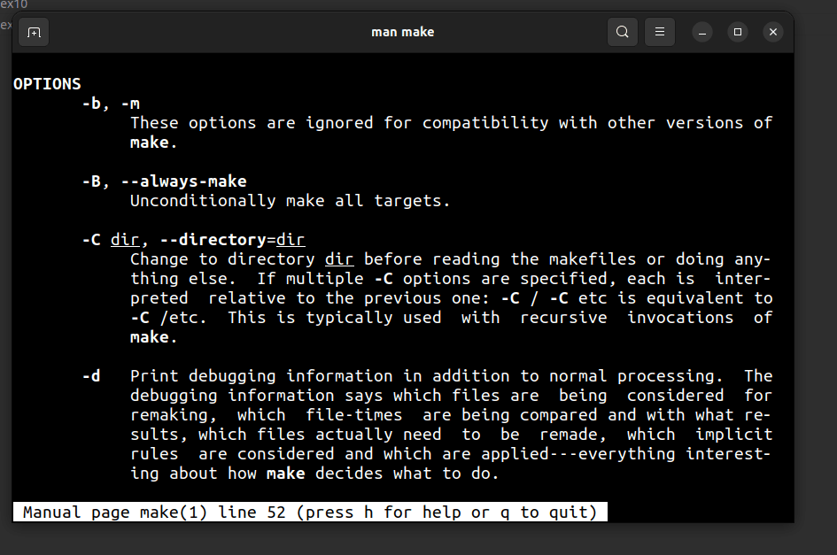
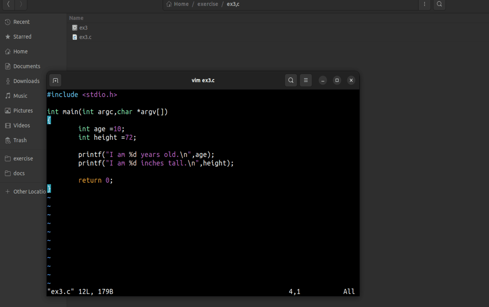
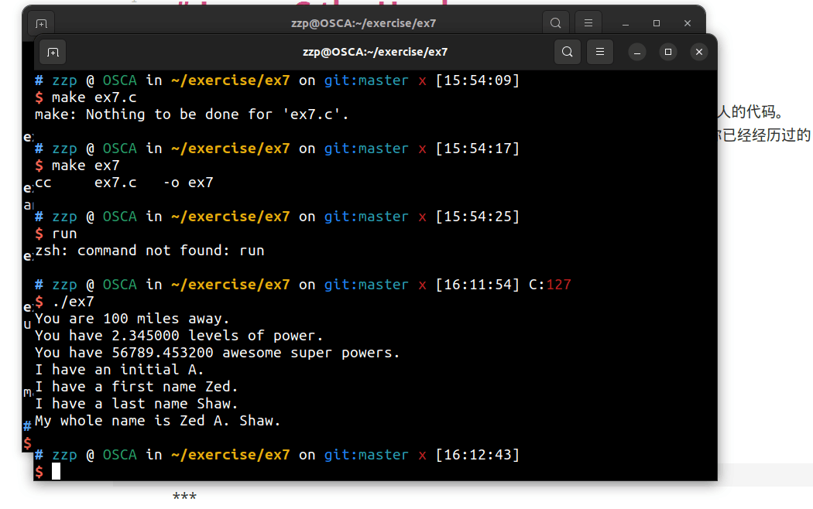
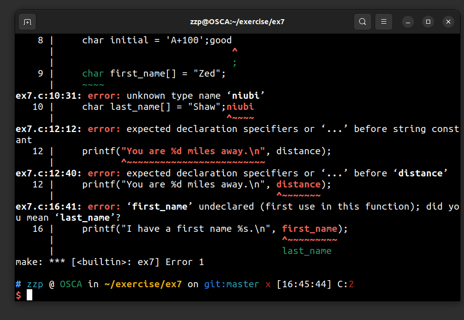
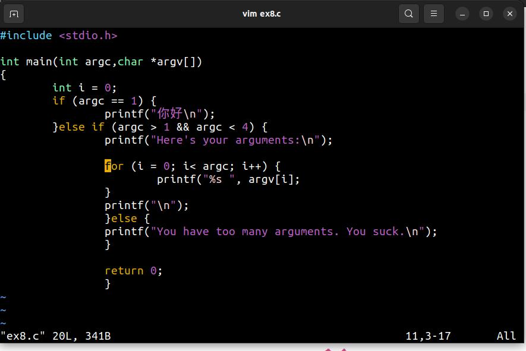
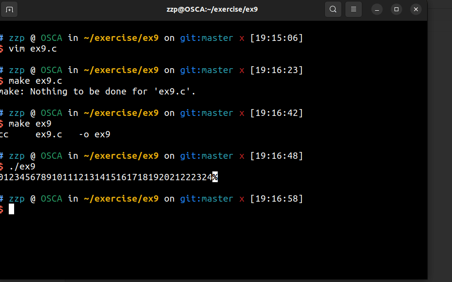
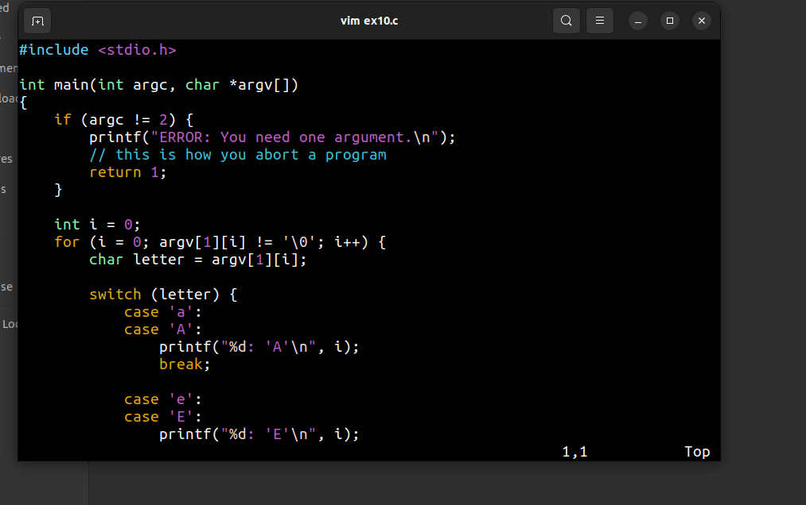
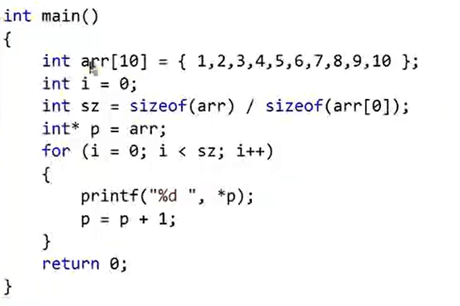
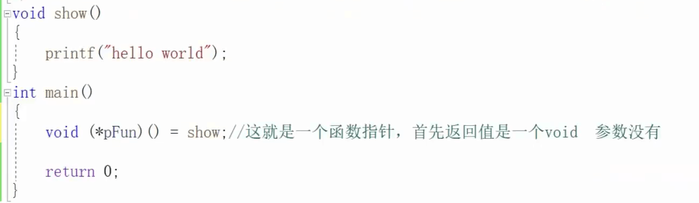

Learn C the Herd way  

## 目的  
这本书的目的是让你足够熟悉C语言，并能够使用它编写自己的软件，或者修改其他人的代码。
这本书中我会让你立即开始编程，之后我会解释你做了什么。这样更有效果，因为你已经经历过的事情解释起来更加容易。  
	
	
***
## ex2 makefile  
### 附加题  
1.man make 
	

	
	
2.man cc
	
~~~html
cc -o hello hello.c   
~~~

这个命令将hello.c编译成一个可执行文件，并将其命名为hello（使用-o选项指定输出文件名）。然后，你可以运行./hello来执行编译后的程序  
‘-wall’这个命令后缀用于在编译过程中开启额外的警告信息，帮助程序员发现代码中潜在的问题或错误  
	
	
3.在另一个C语言项目中找到Makefile文件，并且尝试理解它做了什么。  
- [Makefile工作原理](https://aptx4869-conan.github.io/zzp-blog/sundries/makefile/)
	
	
***
## ex3 格式化打印  
  
	
***
## ex5 运算符，ex6语法    
不再赘述  
附加题  
1.搜索“printf格式化”，试着使用一些高级的占位符。  
- [占位符](https://aptx4869-conan.github.io/zzp-blog/sundries/placeholder/)  
	
	

2.研究可以用几种方法打印数字。尝试以八进制或十六进制打印，或者其它你找到的方法。  
- [进制](https://aptx4869-conan.github.io/zzp-blog/sundries/1/)  
	

3.试着打印空字符串，即""。  
/0  
	
4..上网搜索unsigned做了什么。  
unsigned long 是无符号长整型数据类型，只能表示非负整数。  
	
5.试着自己解释（在下个练习之前）为什么char可以和int相乘。  
- [本题答案](https://aptx4869-conan.github.io/zzp-blog/sundries/2/)  
	
***
## ex7 变量和类型  
make  
  
break  
	
  
	
有很多类型，整数型，浮点型，字符型  
int对应%d  
long 对应%ld  abcdefgabcdefg
short对应%u  
float 对应%f  
double 对应%lf 
char对应%c（单个字符）和%s（字符串）  
字符串即多个字符  
	
	
***
## ex8 if,else  

	
	
	
***
## ex9 while循环和布尔表达式  

	
***
## ex10 switch 循环  

	
	
***
## ex11 数组  

int arr[10]={1，2，3}  
其中int 处填类型  
arr处填数组名  
int arr[10]表示的是生成__10__个位置  
__但是__:数组中的每个元素都可以使用 arr[0] 到 arr[9] 的索引来访问，此时srr[9]才是指的第十个位置，因为在 C 中，数组索引从 0 开始。  
	
	
### 附加题  
1.尝试将areas的一个元素赋值为name中的字符。  
会报错  
	
2.上网搜索在不同的CPU上整数所占的不同大小。  
- [本题答案](https://aptx4869-conan.github.io/zzp-blog/sundries/3/)
	

3.如果一个字符数组占四个字节，一个整数也占4个字节，你可以像整数一样使用整个name吗？你如何用黑魔法实现它？  
- [本题答案](https://aptx4869-conan.github.io/zzp-blog/sundries/4/)
	

4..弄清楚在for循环的每一部分你都可以放置什么样的代码。  
- [for循环](https://aptx4869-conan.github.io/zzp-blog/sundries/5/)
	

5.查询NULL是什么东西  
NULL 是C语言中的一个常见标识符，用于表示空指针，可以帮助在程序中更加清晰地表达和处理空指针相关的情况。  
	
6.argc argv 是什么  
在程序执行时，操作系统会将命令行输入的参数传递给 main 函数。argc 表示参数的数量，而argv 是一个指针数组，每个指针指向一个以 null 结尾的字符串，这些字符串存储了实际传递给程序的命令行参数。argv[0] 存储的是程序的名称。  
	
7.我已经向你简短地介绍了&&，它执行“与”操作。上网搜索与之不同的“布尔运算符”。  
- [布尔运算符](https://aptx4869-conan.github.io/zzp-blog/sundries/6/)  
	

8.使用if语句使循环提前退出。你需要break语句来实现它，搜索它的有关资料。  
在(for、while、do-while)循环中，break 语句可以立即终止当前的循环，将控制转移到循环后的下一个语句。  
在 switch 语句中，break 用于结束当前 case 分支的执行，使程序控制流跳出 switch 语句。  
	
	
### 命令  
sizeof（name）  
问c语言name这个量占多少字节  
	
***
## ex12 For    
for(i = 1; i < argc; i++) {  
printf("arg %d: %s\n", i, argv[i]);     
}    
其中i=1:初始化的变量/.  
i < argc : 判断条件（不满足时会执行大括号里面的，满足则继续循环）  
i++ : 自增恒量变量，就是循环的内容  
其实不只是可以++，还可以+=2，就是自增2，可以在循环中用
	
	
***
## ex12while语句  
语法:  
while(i＜arge)  
{  
printf"xxx";  
i++;  
}   
其中（）中的__条件__，如果是true则执行大括号里面的，如果是false则跳出括号。  

布尔表达式:只有true和false
	
	
***
## ex13 Switch 语句  
语法：  
switch(表达式){  
case   
case  
default  
	
	
***
## ex14 编写并使用函数  
自己声明函数就跟脚本一样  
比如以下  
~~~
void print_arguments(int argc, char *argv[])
{
    int i = 0;

    for(i = 0; i < argc; i++) {
        print_letters(argv[i]);
    }
~~~

***
## ex15 指针  

-[什么是指针](https://aptx4869-conan.github.io/zzp-blog/sundries/7/)  
### 指针+-整数
  
数组是什么，默认是首元素的地址  指针取数组的地址实际是取的首元素的地址，也就是索引为0的地址  比如int\*p = arr  
但是如果int\* p = &arr ，取出的是数组本身的地址  
这张图片中的指针加整数的意思是让它往后索引几个  
### 指针数组和数组指针  
指针数组 - 数组 -存放指针的数组  
数组指针 - 指针  
字符串指针数组：char \*names[ ]  
这种声明方式创建了一个数组，数组的每个元素都是一个指向字符串的指针。  
相比于char  names[ ] 的优点：  
- [链接](https://aptx4869-conan.github.io/zzp-blog/sundries/8/)  
	
### ex15 题目与附加题  
-[链接](https://aptx4869-conan.github.io/zzp-blog/sundries/9/)  
	
	
	
## ex16 结构体和指向它们的指针  
-[结构体](https://aptx4869-conan.github.io/zzp-blog/sundries/10/)  
- [作业与附加题](https://aptx4869-conan.github.io/zzp-blog/sundries/11/)  
	
	
	
	
	
***
## ex17 堆和栈的内存分配  
-[堆和栈的内存分配](https://aptx4869-conan.github.io/zzp-blog/sundries/13/)  
-[作业与附加题](https://aptx4869-conan.github.io/zzp-blog/sundries/12/)  
	
	
***
## ex18函数指针  
函数指针的格式类似这样：  
~~~
int (指针名)(int a, int b)  
~~~
记住如何编写它的一个方法是：  
	
编写一个普通的函数声明：  
~~~
int callme(int a, int b)  
~~~
将函数用指针语法包装：  
~~~ 
int (*callme)(int a, int b)  
~~~
将名称改成指针名称：   
~~~
int (*compare_cb)(int a, int b)  
~~~
指针的变量名称为compare_cb，你可以将它用作函数。这类似于指向数组的指针可以表示所指向的数组。指向函数的指针也可以用作表示所指向的函数，只不过是不同的名字。  
  
这就是一个函数指针，它储存了show这个函数  
为了和普通指针区别一下，它用了括号括住了  
调用函数可以直接用show()或者 pFun()  
### 回调函数  
有两个函数A,B，函数A有参数，参数是函数B，则B就是回调函数  
被当做参数来使用的函数就是回调函数  
-[回调函数](https://aptx4869-conan.github.io/zzp-blog/sundries/14/)  
	
	
## ex19 一个简单的对象系统  
-[预处理和宏定义](https://aptx4869-conan.github.io/zzp-blog/sundries/15/)  
### C中构建面向对象系统  
-[C中构建面向对象系统](https://aptx4869-conan.github.io/zzp-blog/sundries/16/)  