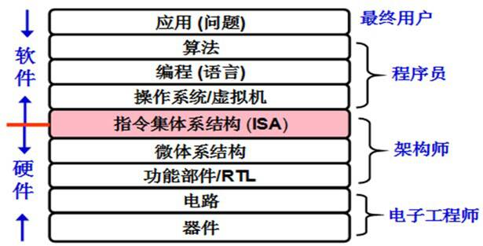

# 计算机系统
## 为什么要学习计算机系统

为什么要学计算机系统基础:是对"__计算机能做什么__"这个问题的探索，知其然，知其所以然  

计算机专业的学生相比于其他专业的学生，既不会硬件，也不会其他领域的应用  

所以要学计算机系统，而计算机系统，不是简单的PC，而是包括WSC(大规模数据中心) PMD(个人移动设备) 和PC的计算机系统，计算机专业培养的的应该是计算机系统方面的人才，强调系统设计  

***  
  
要求以下__能力__  

- 能够对软, 硬件功能进行合理划分  
-  *划分归类*  
- 能够对系统不同层次进行抽象和封装  
- *不同层次抽象*  
- 能够对系统的整体性能进行分析和调优  
- *优化*  
- 能够对系统各层面的错误进行调试和修正  
- *修复BUGS*  
- 能够根据系统实现机理对用户程序进行准确的性能评估和优化  
- *优化设计*  
- 能够根据不同的应用要求合理构建系统框架等  
- *构建os*  
***
要 达到上述这些在系统层面上的分析, 设计, 检错和调优等系统能力, 显然需要提高学生对整个计算机系统实现机理的认识, 包括:  

对计算机系统整机概念的认识  

对计算机系统层次结构的深刻理解  

对高级语言程序, ISA, OS, 编译器, 链接器等之间关系的深入掌握  

对指令在硬件上执行过程的理解和认识  

对构成计算机硬件的基本电路特性和设计方法等的基本了解  

从而能够更深刻地理解时空开销和权衡, 抽象和建模, 分而治之, 缓存和局部性, 吞吐率和时延, 并发和并行, 远程过程调用(RPC), 权限和保护等重要的核心概念, 掌握现代计算机系统中最核心的技术和实现方法  
***
### 知识不等于掌握，还需要实践  
除了纯理论工作之外, 计算机相关的工作无不强调动手实践的能力.  
很多时候, 你会觉得理解某一个知识点是一件简单是事情, 但当你真正动手实践的时候, 你才发现你的之前的理解只是停留在表面.  
例如你知道链表的基本结构, 但你能写出一个正确的链表程序吗?   
你知道程序加载的基本原理, 但你能写一个加载器来加载程序吗?   
你知道编译器, 操作系统, CPU的基本功能, 但你能写一个编译器, 操作系统, CPU吗?   
你甚至会发现, 虽然你在程序设计课上写过很多程序, 但你可能连下面这个看似很简单的问题都无法回答:  

 终极拷问:当你运行一个Hello World程序的时候, 计算机究竟做了些什么?  