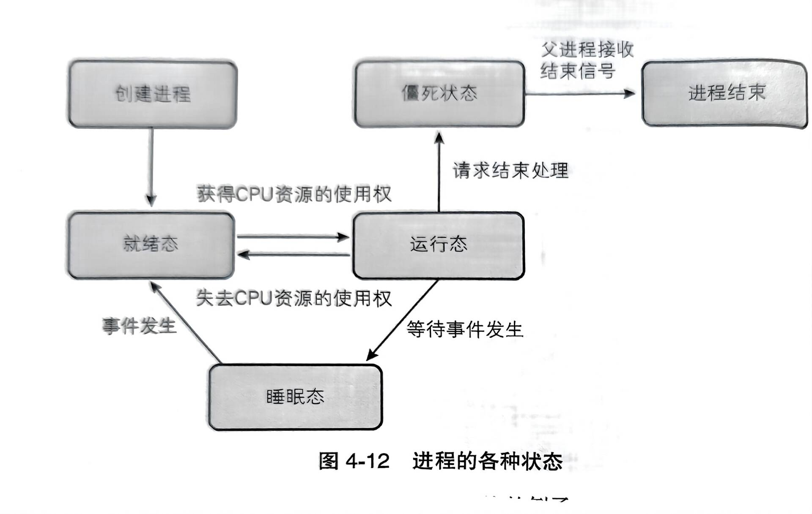
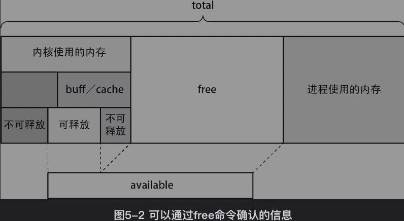
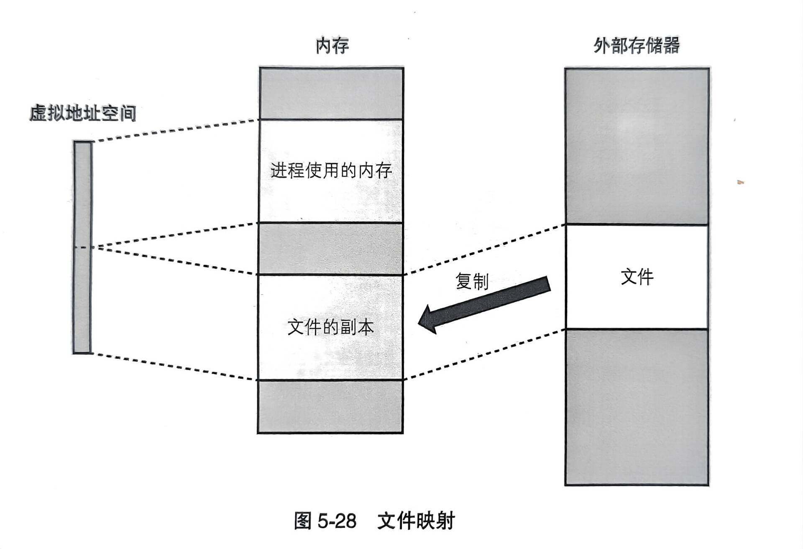

# Linux 是怎样运行的  
!!! tip "1.计算机系统概要"

    操作系统是连接程序和硬件的，操作系统帮你和硬件打交道
    
    计算机主要硬件：
    CPU 内存 输入输出 外部存储器 网络适配器
    
    进程和OS的关系：
    ！
    
    进程和硬件关系：
    进程和外部设备（比如键盘）之间通过驱动程序
    进程和外部储存之间有文件系统和外部储存设备驱动

​	
!!! tip "2.用户模式实现的功能"

    内核定义：
    内核是操作系统的核心
    内核的主要功能包括：
    中段服务程序+进程调度器+内存管理程序+进程间通信等服务
    
    可以从进程切换到内核模式来进行一些敏感操作
    Linux提供了内核的本质的一些程序，还提供了一些库，比如C标准库，还提供了一些程序
    程序包括初始化系统:init
    变更系统运行方式：sysctl nice sync
    文件操作:touch mkdir
    文本处理数据：grep sort uniq
    性能测试:sar iostat
    编译:gcc
    脚本运行环境：perl python ruby
    shell:bash
    视窗环境：X
    
    库：glibc基本包括所有的C程序库
	
!!! tip "3.进程管理"

    创建进程的目的：一个程序由多个进程提供服务，一个进程创建另一个新的程序
    
    fork函数创建父子进程
    对应第一点
    ~~~
    #include <unistd.h>
    pid_t fork(void);
    ~~~
    返回值是进程ID（PID，pid）。在父进程中，
    fork 返回子进程的PID；在子进程中，返回值是0。如果 
    fork 失败，则返回 -1。
    
    execve()创建新程序的过程
    对应第二点
    ~~~
    #include <unistd.h>
    int execve(const char *filename, char *const argv[], char *const envp[]);
    ~~~
    filename 参数是要执行的程序的路径。
    argv 参数是一个字符串数组，表示新程序的命令行参数，最后一个元素应该是 NULL。
    envp 参数是一个字符串数组，表示新程序的环境变量，同样以 NULL 结尾。
	
!!! tip "4.进程调度器"

    Linux 内核的进程调度器（Scheduler）是负责管理和调度系统中运行的进程的一部分。它    决定哪个进程应该在给定的时间片内运行，并以何种顺序轮流执行各个进程。进程调度器的目标是合理分配 CPU 时间，提高系统的性能和响应能力。
    
    不管同时运行多少进程，在任意时间点上，只有一个进程能运行在逻辑CPU上，所有进程是逐个进行
    
     状态转换
    有就绪态，睡眠态，运行态，僵死状态
    
    
    当没有程序时，会给你创造一个空闲进程，空闲进程啥也不干
    
    吞吐量：单位时间总工作量
    延迟：各种处理花费的时间，越短越好
    吞吐率（每个逻辑CPU能处理多少个程序）
    
    在逻辑CPU没被打满时，增加ready的进程可以提高吞吐率
    
    打满时，增加ready的进程会提高延迟
    
    当所有逻辑CPU都被打满，并且没有ready的进程在排队等待调度时，吞吐和延迟达到最优
    
    用ps ax 看进程的运行状态。
    R是运行态或就绪态
    S或D是睡眠态
    Z是僵死状态
    
    用sar -q 的runq_sz字段，看多少程序处于运行状态
    sar -P ALL 1 是每一秒展示一下CPU状态
    %user（用户态CPU使用百分比）： 表示在用户态运行的进程所占用的CPU时间百分比。
    
    %nice（优先级较高的用户态CPU使用百分比）： 表示以较高优先级运行的用户进程所占用的CPU时间百分比。
    
    %system（内核态CPU使用百分比）： 表示在内核态运行的进程所占用的CPU时间百分比。
    
    %iowait（等待IO的CPU时间百分比）： 表示CPU等待IO操作完成所占用的时间百分比。这通常反映了IO密集型任务。
    
    %steal（虚拟化环境中被其他虚拟机抢占的CPU时间百分比）： 表示虚拟化环境中虚拟机被其他虚拟机抢占的CPU时间百分比。
    
    %idle（CPU空闲时间百分比）： 表示CPU空闲的时间百分比。
    
    运行时间real 和执行时间(user,sys,nice)
    运行时间大于执行时间
    time sleep 3
    （user+sys）cpu0+(user+sys)cpu1
    
    $ taskset -c 0./sched<n><total><resol>
    n是开n个进程
    total是运行了多少秒
    resol是每一秒采样几次
	
!!! tip "5.内存管理"

    $ free 通过free命令获取系统搭载的内存总量和已消耗的内存量
    
    total： 总内存大小，表示系统当前可用的所有物理内存总和。
    
    used： 已使用的内存大小，表示当前已被系统和应用程序占用的内存总量。
    
    free： 空闲内存大小，表示当前未被系统和应用程序使用的内存总量。
    
    shared： 共享内存大小，表示多个进程共享使用的内存总量。在现代系统中，这个值通常为 0。
    
    buff/cache： 缓存和缓冲区内存大小，表示被系统用于缓存文件系统和块设备的内存总量。
    
    buffers： 缓冲区内存大小，表示被系统用于缓存块设备的内存总量。
    
    cache： 缓存内存大小，表示被系统用于缓存文件系统的内存总量。
    
    available： 可用内存大小，表示系统当前可供应用程序使用的内存总量。这个值考虑了缓存和缓冲区，是系统实际上可用的内存。
    
    注意：free 命令的输出中的所有数值默认以千字节（KB）为单位。可以使用 -h 参数，以人类可读的方式显示输出，即将数值转换为更大的单位（例如，兆字节或吉字节）。
    
    
    内存不足时，OOM killer 会随机选择一个程序强行结束进程
    
    虚拟内存实现了进程间独立的地址空间，进程间不会相互破坏内存数据，缓解了内存碎片化的问题;隔离了多个进程的内存，保障了安全性；
    
    那么如何管理虚拟地址呢，用页表,页表放在内核区域
    
    分配内存的时机：
    1.创建进程时，需要先分配一定的内存
    2.程序运行时分配内存，eg：调用malloc在虚拟空间分配内存池
    
    malloc和mmap的区别
    malloc 以字节为单位申请内存
    mmap以页为单位申请内存
    
    文件映射
    调用文件时可以用read(),weite(),和lseek()
    还可以将文件区域映射读取到内存中，再把这个内存区域映射到虚拟地址空间
    