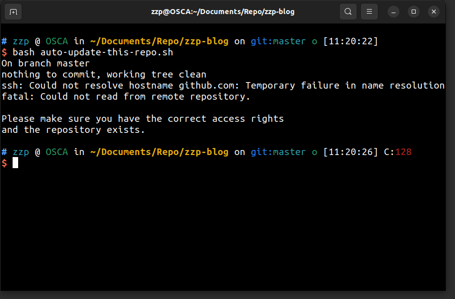
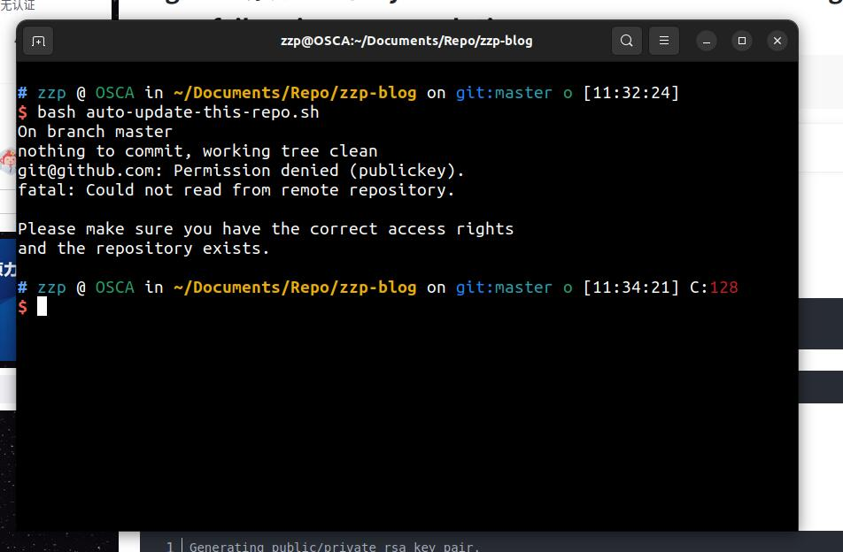

# 问题与解决方案汇总  
## 联网问题  
### 问题  
  
	
### 解决方法  
在终端输入  
~~~
sudo service NetworkManager stop  
	
sudo rm /var/lib/NetworkManager/NetworkManager.state  
	
sudo service NetworkManager start  
~~~

或者用这个脚本(DIY)  

## github 上传的问题  
### 问题  
	
### 解决方法  
[原文链接](https://blog.csdn.net/fine_Y/article/details/131828604)  
	
## 虚拟机与 windows 无法复制粘贴  
### 解决方法：重启虚拟机 .  
	
	
	
***
## makefile:10: **\* missing separator.  Stop.(错误)  
~~~
ChatGPT
这个错误提示通常在使用 Makefile 时出现。它意味着在 Makefile 的第 10 行或者附近有语法错误，通常是因为缩进或者制表符的问题。

在 Makefile 中，命令通常需要以Tab键作为开头的缩进。如果你在 Makefile 中使用了空格而不是Tab键来缩进命令，就会导致出现类似 "*** missing separator. Stop." 的错误。

要解决这个问题，你可以检查 Makefile 中第 10 行附近的代码，确保命令行以Tab键开头而不是空格。确保所有命令都正确缩进，没有混用空格和制表符。此外，也可以尝试在文本编辑器中查看隐藏字符，确认使用了正确的缩进方式。
~~~