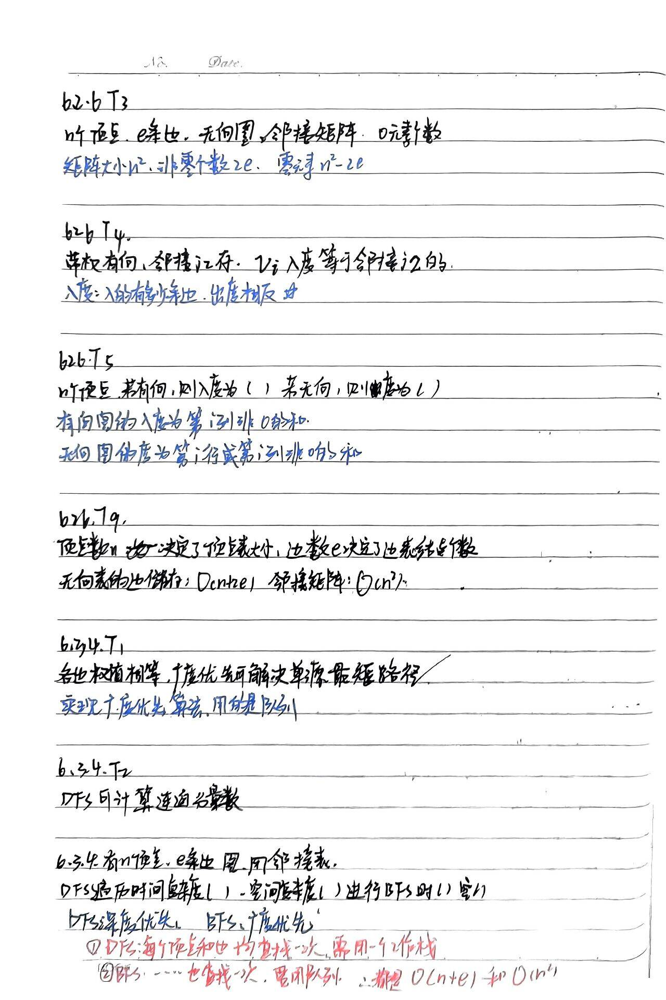
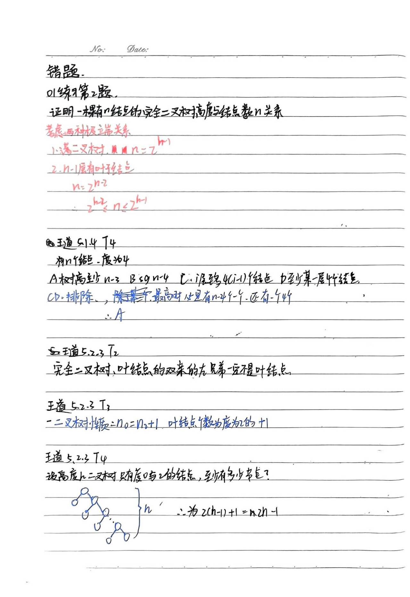

# 每日日记  
!!! example "2024.1.27"

    100词，数据结构第五课
??? tip "笔记"

    
    
??? tip "错题"

    
***
!!! example "2024.1.26"

    100词，数据结构第五课
??? tip "笔记"

    
    
    
    
??? tip "错题"

    
***
!!! example "2024.1.25"

    100词，数据结构第四课
??? tip "笔记"

    
    
    
    
??? tip "错题"

    
!!! example "2024.1.24"

    100词，数据结构第三课
??? tip "笔记"

    
    
??? tip "错题 "

    
    
***
!!! example "2024.1.23"

    100词，数据结构第二课
??? tip "笔记"

    
    
    
    
??? tip "错题"

    
    
***
!!! example "2024.1.22"

    背了100词，数据结构第一章绪论和第二章线性表
??? tip "笔记"

    
    
    
    
    
??? tip "例题"

    01第一章练习题第六题
    01第二章练习题第四题
    王道2.2.3第三题
    王道2.3.7第5题
    
    王道2.3.7第22题
    
***
!!! example "2024.1.21"

    背了100词，《linux》第五章完结

***

