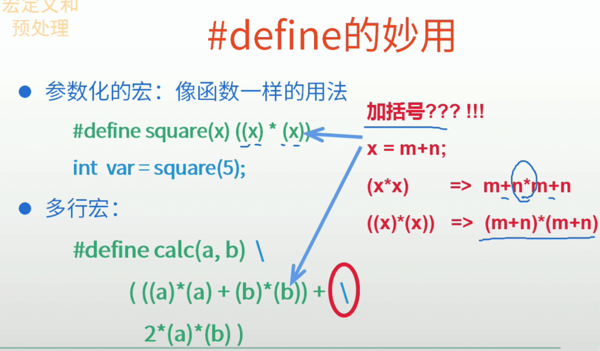

# 预处理和宏定义  
## 预处理  
预处理不是真正编译的一部分 它是编译代码前一个单独的步骤  
## 宏  
宏（Macro）在 C 语言中是一种非常有用的_工具_，它允许你用一个_标识符_来代表一个值或者一段代码，然后在程序中通过这个标识符来_引用_这个值或代码。  
### 用途  
1. 创建常量：可以使用宏来定义常量，例如：
~~~
#define PI 3.14159

~~~

这样就定义了一个名为_ PI _的宏，它代表的值是 3.14159。这样在程序中就可以使用 PI 这个_标识符_来表示 π 的值了  
	
2. 简化代码：宏也可以用于简化代码。比如，你可以创建一个计算平方的宏：  
~~~
#define SQUARE(x) ((x) * (x))

~~~
然后在程序中使用 SQUARE 这个宏，传入一个参数 x：  
~~~
int result = SQUARE(5); // 会被展开为 ((5) * (5))

~~~
这样就避免了每次都写 x * x，提高了代码的可读性和易用性。  
	
3. 条件编译：宏还可以用于条件编译，例如：  
~~~
#define DEBUG 1

#ifdef DEBUG
    // 调试代码
    // 这部分代码只有在 DEBUG 被定义的情况下才会被编译
#endif

~~~
这种方式可以让你根据宏的定义与否来控制代码的编译。  
	
虽然宏在某些情况下非常有用，但也要注意宏的一些_潜在问题_，比如宏展开可能导致代码难以调试、宏的作用域难以控制等。因此，在使用宏时需要谨慎并遵循最佳实践，以避免潜在的问题。  
## 宏的本质  
预处理器只不过是做了一个文本替换的工作而已  
所有预处理命令都是以#开头   
### 常见的预指令处理   
  
1. #include  
#include 指令用于将*其他文件的内容包含到当前文件中*。这是用于引入头文件的常见方式，使得程序可以重复利用其他文件中的函数声明、宏定义等信息。
2. #define
#define *用于创建宏定义*，将一个标识符或表达式定义为一个特定的代码片段。这种方式可以用于创建常量、简化代码或定义一段代码片段。
3. #ifdef, #ifndef, #else, #endif
条件编译指令用于根据条件来控制代码的编译。比如，#ifdef 用于检查某个宏*是否已经被定义*，#ifndef 用于检查某个宏*是否未被定义*，#else 和 #endif 则用于*定义条件的分支和结束。*
4. #undef
#undef 用于取消宏的定义，使得该宏可以重新定义或者在之后的代码中不再生效。
5. #error
#error 用于生成编译时错误信息，当预处理器遇到这个指令时，会停止编译并显示指定的错误消息。
6. #pragma
#pragma 用于向编译器传递特定的指令。这些指令通常用于控制编译器的行为，如优化选项、警告信息等。
7. 文件包含保护指令
	用于防止头文件被多次包含而导致的重定义错误。常见的方式是使用 #ifndef, #define, #endif 来创建头文件的包含保护结构。
	
	​	

宏中的小问题，加括号  
