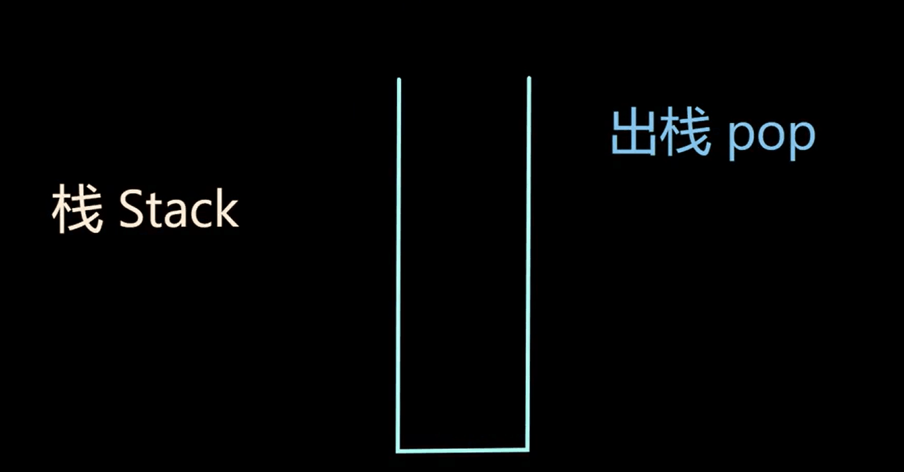

# 栈，作用域和全局  
在编程中，栈（Stack）、作用域（Scope）和全局（Global）是三个与变量和内存管理相关的重要概念。  
	
1. 栈（Stack）：  
	栈是一种数据结构，通常用于存储函数调用期间的局部变量、函数参数和返回地址等信息。在程序执行期间，每当一个函数被调用时，系统都会为该函数创建一个称为“栈帧”的区域，用于存储函数中的局部变量以及执行过程中的其他信息。栈是一种“后进先出”（Last-In, First-Out，LIFO）的数据结构，最后进入栈的数据首先被取出。当函数执行完毕返回时，相应的栈帧会被销毁，释放栈空间。   
	栈只有一个口子，所以只有两个操作 压栈和出栈  
	  

  
	
2. 作用域（Scope）：  
	作用域是指在程序中可以访问变量的区域。在 C、C++、Java 等编程语言中，通常存在全局作用域和局部作用域。局部作用域是指变量只能在其声明的区域内访问，例如在函数内部声明的变量只能在该函数内部使用，这些变量具有局部作用域。全局作用域中的变量可以在整个程序中被访问，其生命周期持续整个程序的执行过程。  
	
3. 全局（Global）：  
	全局是指在整个程序中都可以访问的变量、函数或其他实体。全局变量是在整个程序的执行过程中都存在的，其作用域是整个程序。全局变量通常在程序的顶层位置声明，并且在程序的任何地方都可以被引用。  
	

总结：  
	
栈是用于存储函数调用期间的局部数据的数据结构，遵循后进先出的原则。  
作用域指定了变量的可见性和访问范围，局部作用域和全局作用域是常见的作用域类型。  
全局表示在整个程序中可访问的变量或实体，在程序的任何地方都可以使用。  
这些概念在程序设计中非常重要，了解它们有助于正确地管理变量的生命周期、作用域和内存分配。  
	
	
<mark>extern</mark>  
	
这个关键词告诉编译器“这个变量已存在，但是他在别的‘外部区域’里”。通常它的意思是一个.c文件要用到另一个.c文件中定义的变量。这种情况下，我们可以说ex22.c中的THE_SIZE变量能被ex22_main.c访问到。  
	
<mark>static</mark>（文件）
	
这个关键词某种意义上是`extern`的反义词，意思是这个变量只能在当前的.c文件中使用，程序的其它部分不可访问。要记住文件级别的`static`（比如这里的THE_AGE）和其它位置不同。  
	
<mark>static</mark>（函数）   
	
如果你使用`static`在函数中声明变量，它和文件中的`static`定义类似，但是只能够在该函数中访问。它是一种创建某个函数的持续状态的方法，但事实上它很少用于现代的C语言，因为它们很难和线程一起使用。  
	
	
