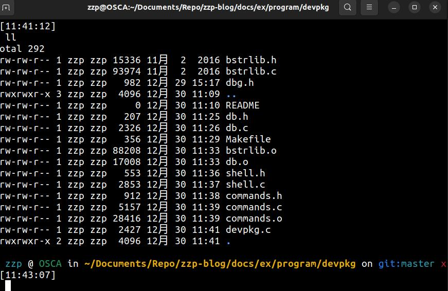
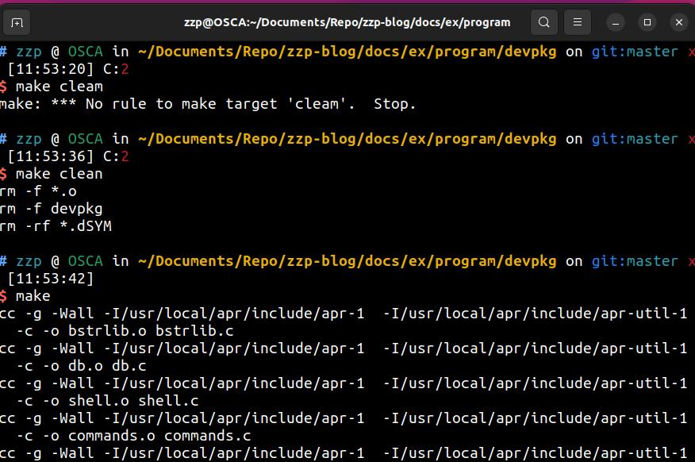

# 编写一个真正的程序  
1. 首先需要项目布局  
创建`Makefile` 和 `README`	  
2. 然后需要测试宏dbg.h，和从`http://bstring.sourceforge.net/`下载的bstrlib.h和bstrlib.c。下载.zip文件，解压并且将这个两个文件拷贝到项目中。  
3. 然后构建Makefile  
4. 创建并构建db.h 和db.c  
5. 创建并构建shell.h 和 shell.c  
6. 编写commands.h文件，commands.c文件  
7. 构建mevpkg.c  
  
  