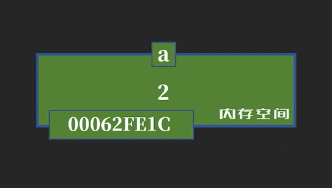
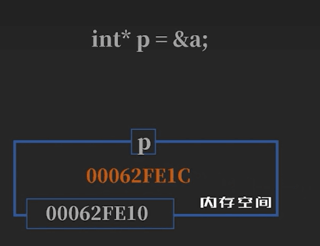

# 指针  
## 内存空间  

比如 int a =1 就是为a申请一个地方，名字为a，但是地址不会变。  
int 类型储存的东西是整数  
	
了解内存空间之后，指针就好理解了  
指针和 int一样，也是一种类型，不过它储存的是一个地址
比如int\*p = &a  

	
指针名字叫p，int\*p指的是p是一个指针  &a是一个地址  
int\*p = &a 代表的是把a的地址保存到p中  
Int d = p 的话会直接报错，要int d =\*p  
就把1这个数给了d   
上面用到了两个\*，但此星非彼星  
上面的\*是int\* ，是一种指针类型，同理有char\*,short\*,等  
下面的星是间接运算符，是间接引用a的值。  
